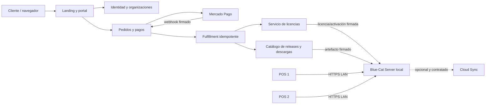

# Blue-Cat: plan ágil hacia la Beta comercial

> Documento canónico de producto y entrega
>
> Fecha de corte: 20 de julio de 2026
>
> Estado real: **alfa técnica avanzada — Fase 4 en prototipo**
>
> Próxima meta: **Beta cerrada instalable, licenciada y operable en dos POS LAN**

## 1. Resumen ejecutivo

Blue-Cat todavía no está listo para vender licencias ni habilitar descargas automáticas. El núcleo POS tiene una base valiosa —venta atómica e idempotente, caja, pagos mixtos, devoluciones, promociones, aislamiento por cuenta y autorización de supervisor— y ya existe un prototipo de instalador Windows. Sin embargo, hay defectos críticos de permisos e inventario, el instalador no está firmado ni certificado en máquinas limpias, el cliente LAN aún no se empareja con un servidor remoto, y el licenciamiento actual solo consulta tablas locales modificables.

La landing también es una alfa visual. Puede presentar la oferta y recibir solicitudes, pero todavía no posee identidad de clientes, pago automatizado, portal, correo transaccional, emisión de licencias ni descarga protegida. El comercio debe permanecer deshabilitado hasta cerrar sus bloqueadores críticos.

La secuencia correcta es:

1. estabilizar y asegurar el producto local;
2. formalizar planes y capacidades;
3. construir identidad, pedidos y pagos en la landing;
4. emitir licencias y artefactos firmados;
5. integrar activación online/offline sin depender de Internet para vender;
6. certificar instalación, dos POS LAN, backup, recuperación y actualización;
7. ejecutar pruebas de usuario y un piloto real antes de cobrar públicamente.

Con tres desarrolladores y apoyo dedicado de QA/seguridad, la estimación responsable es **14 a 18 semanas**; con dos desarrolladores y QA, **18 a 24 semanas**; con una sola persona, **24 a 30 semanas**. La sincronización de sucursales en nube se mantiene como producto mensual separado y comienza después de estabilizar la Beta local.

## 2. En qué fase estamos

| Fase histórica | Estado | Evidencia y brecha principal |
|---|---|---|
| 0. Gobierno y repositorio | Parcial | Hay ADR, migraciones, CI y tag inicial; `master` no está protegida y los escaneos de seguridad están desactivados. |
| 1. Datos y aislamiento | Avanzada, no cerrada | Existen pruebas multicuenta; el API de empleados todavía vulnera la matriz de autorización. |
| 2. Integridad POS | Avanzada, no cerrada | Venta/caja/pagos tienen buena base; inventario físico, decimales por peso y transacciones de stock tienen defectos críticos. |
| 3. Permisos y seguridad | Parcial | Hay sesiones, CSRF, auditoría y autorización de supervisor; faltan controles uniformes en todos los endpoints y E2E por rol. |
| 4. Instalador Windows | Prototipo funcional | Caddy, PHP, MariaDB, servicios y WebView2 existen; faltan firma, release reproducible y certificación en Windows limpio. |
| 5. Clientes LAN | Inicial | Hay HTTPS LAN; faltan dirección remota, emparejamiento, confianza TLS, registro y revocación de terminales. |
| 6. Licencias y planes | Diseño solamente | `validar_licencia` lee datos locales; no hay firma asimétrica, activación, servidor de licencias ni enforcement confiable. |
| 7. Backup/actualización | Inicial | Hay estructura y documentación, pero no un recorrido probado de backup, restore, upgrade y rollback. |
| 8. Calidad integral | Parcial | Hay suites PHP valiosas; faltan E2E de navegador, visuales, accesibilidad, rendimiento, fallos e instalación automatizada. |
| 9. Piloto Beta | No iniciada | No existe evidencia de operación real sostenida en comercios piloto. |

### Clasificación actual por proyecto

| Proyecto | Estado | ¿Puede ponerse en producción? |
|---|---|---|
| Blue-Cat aplicación local | Alfa avanzada | No; cerrar P0/P1 y regresión integral. |
| Instalador/launcher Windows | Prototipo de Fase 4 | No; no está firmado ni certificado. |
| Cliente POS LAN | Diseño/prototipo local | No; solo abre `https://localhost`. |
| Landing comercial | Alfa visual/técnica | No; mantener compra real deshabilitada. |
| Portal de cliente | No iniciado | No. |
| Pagos Mercado Pago | No iniciado | No. |
| Servicio de licencias | No iniciado | No. |
| Cloud Sync multisucursal | Descubrimiento | Fuera de la primera Beta local. |

## 3. Bloqueadores inmediatos antes de ampliar alcance

Estos problemas forman el Sprint 1 y bloquean cualquier Beta:

| Prioridad | Problema actual | Riesgo | Resultado exigido |
|---|---|---|---|
| P0 | Lectura y mutaciones de empleados sin permisos uniformes en `assets/api/empleados.php` | Fuga de datos personales y escalamiento de privilegios | Toda consulta y acción exige permiso, cuenta y alcance; pruebas negativas por rol. |
| P0 | Cierre de inventario lee el resultado antes de ejecutar la consulta en `assets/api/inventario.php` | Cierre físico roto/inconsistente | Ejecutar, validar tenant y bloquear dentro de una transacción. |
| P0 | Cantidades de productos por peso se convierten a entero | Pérdida silenciosa de stock y dinero | Mantener `DECIMAL` de extremo a extremo en conteo, ajuste, transferencia, venta y devolución. |
| P0 | Varias operaciones de inventario no son transaccionales | Cabecera, detalle, stock y kardex pueden divergir | Transacciones, `SELECT ... FOR UPDATE`, idempotencia y pruebas por interrupción. |
| P0 | La landing tiene bloqueadores críticos de seguridad y persistencia | No puede recibir pagos ni documentos de clientes con seguridad | Cerrar los hallazgos críticos del informe Full Stack antes de exponer comercio. |
| P1 | El API de empleados devuelve ruta y línea internas en fallos | Divulgación técnica | Error público genérico más ID correlacionado; detalle solo en logs. |
| P1 | Migraciones ejecutadas durante requests de empleados | Bloqueos, carreras y despliegues irreproducibles | Usar exclusivamente migraciones versionadas. |
| P1 | La UI ofrece editar/eliminar ventas confirmadas mientras el backend devuelve `409` | UX engañosa y permisos incoherentes | Eliminar esos permisos/botones; usar anulación/devolución autorizada. |
| P1 | `master` no protegida y escaneos de secretos/dependencias desactivados | Releases sin control e incidentes evitables | Protección, revisiones, CI requerido, Secret Scanning/Push Protection y Dependabot. |
| P1 | Desinstalación puede purgar datos sin un backup obligatorio | Pérdida total del comercio | Retención por defecto; borrado explícito con doble confirmación y backup verificado. |

El detalle técnico de la landing está en [`blue-cat-landing/docs/full-stack-audit-2026-07-20.md`](../blue-cat-landing/docs/full-stack-audit-2026-07-20.md).

## 4. Producto comercial objetivo

### 4.1 Oferta inicial

| Producto | Forma de cobro | Alcance objetivo |
|---|---|---|
| Blue-Cat PYME Standard | Pago único | Una empresa local, operación POS/inventario, límites definidos de usuarios, cajas, terminales y sucursales. |
| Blue-Cat Enterprise | Pago único o cotización asistida | Capacidades, límites y soporte ampliados; automatización, integraciones y despliegue administrado. |
| Mantenimiento de actualizaciones | Incluido 12 meses; renovación opcional | Acceso a releases publicados durante la vigencia. La versión perpetua ya adquirida no se desactiva. |
| Cloud Sync multisucursal | Suscripción mensual separada | Sincronización y operación coordinada entre servidores geográficamente separados. No es requisito del POS local. |

La definición final de precios, límites, impuestos, soporte, devoluciones, transferencia de equipo y SLA debe aprobarse en Sprint 0. Hoy existen nombres incompatibles —Single/Emprendedor/Negocio/Enterprise, PYME/Enterprise y “Beta Completa”— que no pueden llegar al licenciamiento.

### 4.2 Un producto base, capacidades distintas

PYME y Enterprise sí deben comportarse de manera diferente, pero no conviene mantener dos forks del código. Se construirá un núcleo firmado por versión y un catálogo inmutable de SKU/capacidades. El portal puede entregar bundles distintos —servidor, cliente POS y conectores Enterprise—, pero la autorización real proviene de un entitlement firmado y se valida también en el backend.

```text
acción permitida = capacidad de licencia
                  AND permiso del usuario
                  AND alcance de cuenta/sucursal
                  AND cuota disponible
```

Ocultar un módulo en la navegación solo mejora la UX; nunca reemplaza este control.

### 4.3 Decisión recomendada para la primera Beta

- Automatizar la compra de **PYME Standard** cuando todo su recorrido esté certificado.
- Mantener **Enterprise** como “solicitar cotización” hasta probar sus capacidades y límites reales.
- Mantener **Cloud Sync** como “solicitar evaluación” hasta completar su arquitectura, seguridad, monitoreo y recuperación.
- No prometer sincronización entre sucursales mediante replicación directa de bases de datos. Ese servicio requiere eventos, outbox, idempotencia, resolución de conflictos y operación observada.

## 5. Arquitectura del ecosistema



### 5.1 Separación de datos

- La base operacional local conserva productos, stock, ventas, cajas, clientes, empleados y auditoría.
- El control plane en Internet conserva cuentas del portal, organizaciones, pedidos, pagos, licencias, dispositivos, releases, descargas y soporte.
- Cloud Sync solo puede acceder a datos operacionales cuando el cliente lo contrata y consiente expresamente.
- Ningún POS cliente se conecta directamente a MariaDB; todos consumen la API del servidor local.

### 5.2 Modelo mínimo del control plane

| Dominio | Entidades principales |
|---|---|
| Identidad | `users`, `credentials`, `email_verifications`, `password_resets`, `sessions`, `mfa_factors` |
| Organizaciones | `organizations`, `memberships`, `billing_profiles`, `consents` |
| Catálogo | `product_skus`, `plan_revisions`, `capabilities`, `sku_entitlements`, `prices` |
| Comercio | `orders`, `order_items`, `quotes`, `payments`, `payment_attempts`, `provider_events`, `refunds` |
| Licencias | `entitlements`, `licenses`, `license_entitlements`, `activations`, `devices`, `revocations`, `license_events` |
| Distribución | `releases`, `artifacts`, `manifests`, `download_grants`, `download_events` |
| Cloud | `cloud_subscriptions`, `cloud_tenants`, `sync_nodes` |
| Operación | `outbox_messages`, `email_deliveries`, `audit_events`, `support_cases` |

Los estados de pedido, pago, fulfillment y licencia deben ser máquinas de estado separadas. “Pago aprobado” no equivale a “licencia emitida” hasta que el fulfillment termine de forma idempotente.

## 6. Recorrido completo del cliente

1. El visitante compara PYME, Enterprise y Cloud Sync.
2. Crea una cuenta del portal con correo y acepta términos/privacidad.
3. Recibe un enlace aleatorio, de un solo uso y expiración corta para verificar el correo y definir su contraseña.
4. Crea o confirma su organización y datos de facturación.
5. Elige un SKU y el servidor crea un pedido inmutable con precio, moneda, impuestos y revisión del plan.
6. Paga mediante Mercado Pago o elige transferencia bancaria asistida.
7. El backend verifica el pago; jamás confía en la URL de retorno del navegador.
8. Fulfillment crea una sola vez el entitlement, la licencia y el permiso de descarga correspondientes al pedido.
9. El cliente recibe un correo con el enlace al portal y la disponibilidad de la descarga. No recibe una contraseña en texto plano.
10. Descarga un instalador/bundle firmado mediante un grant temporal y reemitible.
11. Instala Blue-Cat Server y activa online o mediante desafío/respuesta offline.
12. En el primer inicio crea la contraseña del administrador local. Esta identidad es distinta a la cuenta del portal.
13. El asistente configura empresa, sucursal, bodega, caja, moneda, impuestos, numeración, boleta, logo y backup.
14. Empareja cada POS LAN por código/QR aprobado por un administrador.
15. Crea empleados locales, roles y permisos; opera aun sin Internet.
16. El portal permite ver licencia, dispositivos, descargas elegibles, soporte y renovación de mantenimiento/Cloud.

### 6.1 Identidades que no deben mezclarse

| Identidad | Propósito | Dependencia de Internet |
|---|---|---|
| Cuenta del portal | Compra, pagos, licencias, descargas, dispositivos y soporte | Sí para el portal |
| Administrador local Blue-Cat | Configura y administra el comercio | No para operación normal |
| Empleados locales | Cajero, supervisor, bodeguero y otros roles auditables | No para operación normal |

El correo nunca debe contener una contraseña permanente. El secreto se define mediante enlace de un solo uso; las contraseñas se almacenan con Argon2id y las sesiones pueden revocarse.

## 7. Pagos y entrega

### 7.1 Mercado Pago

La opción recomendada es Checkout Pro:

1. Blue-Cat crea un pedido local y una preferencia de pago desde el backend.
2. Envía el ID del pedido como `external_reference` y persiste los IDs del proveedor.
3. Redirige al `init_point` devuelto por Mercado Pago.
4. Recibe y valida la firma del webhook.
5. Deduplica el evento y consulta el pago server-to-server.
6. Comprueba pedido, monto, moneda, estado y beneficiario.
7. Emite el entitlement de forma idempotente.
8. Un reconciliador periódico recupera webhooks perdidos o desordenados.

La pantalla de “pago exitoso” no entrega acceso por sí sola. También deben probarse pagos pendientes/rechazados, duplicados, reembolsos y contracargos. Un link de pago estático puede ser contingencia, no el fundamento de provisioning automático.

Referencias oficiales: [Checkout Pro](https://www.mercadopago.cl/developers/es/docs/checkout-pro/overview), [API de pagos/preferencias](https://www.mercadopago.cl/developers/es/reference/online-payments/checkout-pro/overview) y [Webhooks y firma](https://www.mercadopago.cl/developers/es/docs/your-integrations/notifications/webhooks).

### 7.2 Transferencia bancaria

La transferencia manual puede mantenerse, especialmente para Enterprise, con este control:

- un pedido previo proporciona referencia y monto exacto;
- el comprobante se guarda en almacenamiento privado, no en una carpeta pública;
- se valida tipo, tamaño y contenido, se renombra, se analiza y se registra auditoría;
- la consola interna exige MFA y RBAC;
- una persona revisa y, para montos altos, otra aprueba;
- la conciliación bancaria prevalece sobre la imagen del comprobante;
- solo el estado conciliado inicia fulfillment;
- la aprobación es idempotente y reversible mediante el flujo de reembolso/revocación definido.

## 8. Licenciamiento seguro y funcionamiento offline

### 8.1 Modelo

- **Entitlement:** lo que el cliente compró, con SKU, revisión, capacidades, límites y mantenimiento.
- **Licencia:** proyección canónica firmada de ese derecho.
- **Activación:** consumo autorizado del derecho por una instalación/dispositivo.

El payload de licencia debe incluir, como mínimo: formato, IDs, producto, edición, revisión inmutable, `perpetual_use`, `maintenance_until`, capacidades, límites, instalación/dispositivo, emisión y `kid`. Se firma con Ed25519; el algoritmo aceptado lo decide el código por `kid`, nunca el payload no confiable.

La clave privada permanece en KMS/HSM del control plane. El instalador solo contiene claves públicas. Deben separarse las claves de licencias, manifiestos de actualización, firma Authenticode y Cloud Sync, con rotación y auditoría.

### 8.2 Activación

1. La instalación genera un ID aleatorio y un par de claves de dispositivo.
2. La clave privada se protege con TPM/CNG cuando exista; fallback CNG no exportable más DPAPI `LocalMachine` y ACL restrictiva.
3. El servidor envía licencia, clave pública, nonce y prueba de posesión.
4. El control plane valida entitlement, estado y cuota transaccionalmente.
5. Devuelve un certificado de activación firmado y ligado a esa instalación.
6. Blue-Cat lo valida localmente y lo almacena protegido.

Para equipos sin Internet, Blue-Cat genera un `.bcreq`; el cliente lo sube desde otro dispositivo y descarga un `.bclic` firmado. El nonce es de un solo uso y el proceso es idempotente.

### 8.3 Reglas de negocio y disponibilidad

- Una licencia perpetua activa sigue permitiendo usar la versión elegible aunque termine el mantenimiento.
- El fin de los 12 meses bloquea releases posteriores, no las ventas locales.
- El fin de Cloud Sync detiene la nube, no el POS local.
- No se consulta Internet por cada venta ni apertura de caja.
- Una caída del servicio de licencias por 72 horas no debe detener una instalación ya activada.
- Revocación puede impedir nuevas activaciones, descargas y Cloud; no existe revocación instantánea garantizable en un equipo perpetuo completamente desconectado.

### 8.4 Controles contra keygen, inyección y manipulación

- firmas asimétricas y verificación canónica;
- `kid`/algoritmos permitidos por código y rotación de claves;
- vínculo a la clave del dispositivo, nonce y protección contra replay;
- cuotas de activación con bloqueo transaccional;
- listas de revocación y manifiestos firmados monotónicos;
- releases, hashes, fecha elegible y migraciones en manifiesto firmado;
- instalador/launcher firmados con Authenticode y timestamp;
- grants de descarga aleatorios, hash almacenado, expiración de 10–30 minutos y auditoría;
- enforcement de plan y permisos en backend, no solo JavaScript;
- SAST, DAST, fuzzing de parser de licencia, SBOM, escaneo de secretos/dependencias;
- servicio/verificador nativo firmado para elevar el costo de parcheo local; ofuscación solo como defensa secundaria.

Un administrador de Windows controla físicamente su máquina y puede parchear PHP/binarios. El objetivo realista es impedir falsificación criptográfica, detectar alteración, proteger servicios comerciales y elevar el costo del bypass; no prometer DRM invulnerable.

## 9. Forma de trabajo ágil

### 9.1 Cadencia y equipos

- Sprints de dos semanas; Sprint 0 de una semana.
- Demo funcional y retrospectiva al cierre de cada sprint.
- Refinamiento semanal y triage diario de P0/P1.
- Un solo backlog del ecosistema, con cuatro carriles: núcleo Blue-Cat, instalador/LAN/licencia, landing/comercio y QA/seguridad/release.
- Límite de WIP: ninguna persona mantiene más de una historia principal y una corrección urgente simultáneas.
- Feature flags y `commerce kill switch` para no exponer flujos incompletos.

Roles mínimos: Product Owner, Tech Lead/arquitecto, backend, frontend/UX, QA automatización/UAT y responsable de release/seguridad. En un equipo pequeño una persona puede cubrir varios roles, pero Product Owner y aprobación QA no deben confundirse en tareas de alto riesgo.

### 9.2 Definition of Ready

Una historia entra a sprint cuando contiene:

- persona, valor y criterio de aceptación observable;
- UX y estados vacío/loading/error/offline cuando corresponda;
- contrato API/datos y migración;
- permisos, tenant y amenazas relevantes;
- dependencia de hardware/proveedor;
- estrategia de pruebas, rollback y telemetría/auditoría.

### 9.3 Definition of Done

Una historia termina solo cuando:

- código revisado y sin secretos;
- control aplicado en UI y backend;
- pruebas unitarias, integración y E2E relevantes pasan;
- aislamiento, permisos, concurrencia y casos negativos pasan;
- migración, backup y rollback están definidos si cambia datos;
- UX visual, teclado, accesibilidad y responsive verificados;
- logs/auditoría no exponen secretos;
- documentación y soporte actualizados;
- CI obligatorio en verde y artefacto reproducible cuando aplique.

### 9.4 Estrategia de ramas y releases

- `master` protegida, sin push directo y con checks obligatorios.
- Ramas `codex/` o `feature/` cortas y PR revisado.
- Conventional Commits o convención equivalente y versionado semántico.
- Canales `dev`, `pilot` y `stable`.
- Cada tag produce artefacto inmutable, checksum, SBOM, manifiesto y release notes.
- No crear un tag Beta hasta pasar todos los gates de su alcance.

## 10. Roadmap por sprints

Las fechas comienzan cuando se aprueba Sprint 0 y existe capacidad asignada. Los Sprints 0–12 representan incrementos lógicos y dependencias: con un solo equipo son secuenciales; con varios equipos, los carriles de núcleo local y control plane pueden solaparse, pero sus gates no se omiten.

### Sprint 0 — Decisiones y línea base (1 semana)

**Objetivo:** congelar qué se vende y desde qué baseline.

- aprobar PYME/Enterprise/Cloud, límites, precios, impuestos, soporte, reembolso, transferencia y mantenimiento;
- publicar catálogo de SKU/capacidades versionado;
- decidir Enterprise automatizado o cotización asistida;
- registrar ADR de control plane, identidad, pagos y licencias;
- proteger `master`, activar escaneos y resolver cambios locales/PR pendientes;
- clasificar toda la deuda P0/P1 y asignar responsables;
- preparar entornos local, CI, sandbox, piloto y producción.

**Salida:** backlog priorizado, catálogo aprobado, threat model inicial y build reproducible.

### Sprint 1 — Estabilización crítica Blue-Cat y landing

**Objetivo:** recuperar una base segura antes de agregar comercio.

- corregir permisos/errores/migraciones en empleados;
- corregir inventario físico, decimales y transacciones;
- alinear ventas inmutables con botones/permisos;
- asegurar retención de datos y backup antes de desinstalar;
- cerrar los cinco bloqueadores críticos de la auditoría de landing;
- incorporar suites de seguridad, supervisor, bootstrap e instalador al CI.

**Salida:** cero P0 conocidos en identidad local, stock y venta; CI cubre las suites existentes.

### Sprint 2 — Identidad del portal y organizaciones

**Objetivo:** crear una cuenta comercial segura.

- registro, verificación de correo, login/logout, recuperación y sesiones;
- Argon2id, rate limiting, CSRF, cookies seguras y MFA para operadores internos;
- organizaciones, membresías, consentimiento y perfil de facturación;
- outbox de correo, reintentos, plantillas y trazabilidad;
- portal mínimo con estado de cuenta.

**Salida:** una cuenta verificada puede crear su organización; no se envían contraseñas.

### Sprint 3 — Catálogo, pedidos y transferencia segura

**Objetivo:** vender una revisión exacta de producto sin ambigüedad.

- catálogo inmutable, precios, impuestos, cotizaciones y pedidos;
- portal de pedido/estado/historial;
- máquina de estados y claves de idempotencia;
- transferencia con referencia, carga privada, revisión, conciliación y doble control;
- consola interna restringida y auditada.

**Salida:** una transferencia sandbox conciliada produce exactamente una orden pagada, todavía sin licencia automática.

### Sprint 4 — Mercado Pago y conciliación

**Objetivo:** automatizar pago sin confiar en el navegador.

- adaptador de proveedores y Checkout Pro sandbox;
- preferencias ligadas al pedido y `external_reference`;
- webhook firmado, deduplicación, consulta server-to-server y reconciliador;
- pendientes, rechazados, duplicados, reembolso y contracargo;
- observabilidad y kill switch.

**Salida:** cada escenario sandbox deja estado consistente y nunca duplica fulfillment.

### Sprint 5 — Operación comercial y portal cliente

**Objetivo:** hacer operable compra y soporte.

- consola con MFA/RBAC, búsqueda y segregación de funciones;
- portal de licencias, dispositivos, pedidos, facturas/recibos y soporte;
- auditoría, retención, privacidad y exportación/borrado según política;
- alertas de pago/fulfillment y runbooks.

**Salida:** soporte puede explicar y recuperar cualquier pedido usando IDs correlacionados sin tocar la base manualmente.

### Sprint 6 — Servicio de licencias

**Objetivo:** emitir derechos verificables offline.

- servicio de entitlement/licencia con firma Ed25519 y claves protegidas;
- activación, desactivación, transferencia, reemplazo y cuotas;
- online y desafío/respuesta offline;
- rotación, revocación, reloj alterado, replay y auditoría;
- pruebas unitarias/fuzz del formato canónico.

**Salida:** una licencia alterada o clonada se rechaza; la válida sobrevive sin Internet.

### Sprint 7 — Releases, artefactos y fulfillment

**Objetivo:** entregar el producto correcto y verificable.

- catálogo de releases/artefactos por SKU y canal;
- build reproducible, Authenticode, timestamp, hashes, SBOM y manifiesto firmado;
- grants temporales de descarga e historial;
- fulfillment idempotente pago → entitlement → licencia → descarga → correo;
- conservar la última versión elegible al terminar mantenimiento.

**Salida:** un pedido pagado entrega exactamente el bundle permitido y toda descarga es trazable.

### Sprint 8 — Enforcement local de planes

**Objetivo:** aplicar PYME/Enterprise aun con requests manipulados.

- reemplazar autoridad de tablas locales por licencia/activación firmada;
- validar capacidades y cuotas en un servicio único del backend;
- retirar creación local arbitraria de planes/módulos;
- integrar UI de estado, límites, gracia y recuperación;
- matriz plan × capacidad × endpoint × usuario;
- no bloquear venta por caída del control plane.

**Salida:** modificar UI, tabla local, fecha o request no concede una capacidad.

### Sprint 9 — Instalador, LAN y continuidad

**Objetivo:** instalar y operar dos cajas reales.

- instalador firmado, repair/upgrade/uninstall y política de datos;
- asistente inicial y acceso directo con launcher WebView2;
- URL remota, QR/código de emparejamiento, CA/TLS local y revocación;
- diagnóstico de puerto/firewall/IP/router;
- backup automático/manual, restore en otra máquina y rollback de update;
- dos terminales asociados a cajas físicas distintas.

**Salida:** una VM limpia y dos POS LAN completan instalación, activación, venta y recuperación.

### Sprint 10 — E2E funcional, visual y de usuario

**Objetivo:** certificar el recorrido operativo completo.

- automatizar los recorridos P0 de la sección 11;
- Playwright visual/responsive/accesibilidad;
- pruebas moderadas con dueño, cajero, supervisor y bodeguero;
- impresión, scanner y balanza si están dentro del SKU;
- corregir todos los defectos críticos/altos.

**Salida:** Gate Beta cerrada cumplido y release candidate en canal `pilot`.

### Sprint 11 — Seguridad, rendimiento y recuperación

**Objetivo:** probar condiciones adversas.

- pentest de control plane, portal, licencias, LAN y archivos;
- concurrencia, jornada de ocho horas, DB creciente y p95 LAN;
- cortes de PHP/DB/Caddy/energía, disco lleno y reloj alterado;
- simulacros de clave comprometida, proveedor de pago caído y restore;
- revisión legal/licencias de terceros, privacidad y política comercial.

**Salida:** cero P0/P1, objetivos de rendimiento y runbooks aprobados.

### Sprint 12 — Piloto y Go/No-Go

**Objetivo:** validar el sistema en operación real.

- instalar en 3–5 comercios o, como mínimo inicial, 2 pilotos representativos;
- capacitación, inventario inicial y operación paralela acordada;
- soporte con severidades, SLA piloto y revisión diaria/semanal;
- mínimo dos semanas sin pérdida de venta, stock, caja ni datos;
- restauración real y actualización controlada durante el piloto;
- cierre de defectos y decisión Go/No-Go documentada.

**Salida:** Beta comercial limitada o extensión del piloto con razones objetivas.

## 11. Matriz obligatoria de pruebas de aceptación

### 11.1 Instalación, activación y configuración

- Windows 10/11 limpio, sin Laragon: instalar, reiniciar, iniciar servicios, shortcut y WebView2.
- Puerto 443 ocupado, firewall bloqueado, sin Internet, antivirus, espacio insuficiente y ruta con espacios/acentos.
- Activación PYME/Enterprise online y offline; licencia inválida, revocada, clonada, sin cuota y con reloj manipulado.
- Primer inicio: empresa, sucursal, bodega, caja, moneda, IVA/otro impuesto, numeración, plantilla, logo y backup.
- Upgrade con copia de datos reales, migración, conteos/FK y rollback.
- Repair y desinstalación conservando datos por defecto; purga solo con confirmación y backup verificable.

### 11.2 Catálogo e inventario

- crear/editar/desactivar categorías, marcas, productos y variantes;
- SKU/código de barras único; producto unitario y por peso/volumen;
- separar “actualizar stock” de “actualizar costo/precio/impuesto” y registrar ticket/razón;
- entradas, salidas, ajustes, transferencias, inventario físico, kardex y alertas;
- cantidades `0,125`, `0,500` y `1,275` sin truncamiento;
- costo neto/bruto, IVA configurable, margen y redondeo monetario;
- importación/exportación XLS/XLSX: válido, nulos, duplicados, errores por fila, archivo grande, fórmula maliciosa y round-trip.

### 11.3 Empleados, roles y permisos

- crear, editar, desactivar, desvincular y eliminar credenciales con política de conservación/auditoría;
- roles cajero, supervisor y bodeguero sin duplicados;
- matriz positiva/negativa por UI y request API directo;
- cambio de permiso se refleja en inicio, navbar, módulo y endpoint;
- empleado comparte productos/stock de su cuenta, nunca los de otra cuenta;
- cajero ve sus ventas en solo lectura; administrador ve el alcance autorizado;
- revocar usuario invalida todas sus sesiones inmediatamente;
- datos sensibles de RR.HH. requieren permisos específicos.

### 11.4 Caja y venta POS

- abrir una caja física; impedir doble apertura incompatible y recuperar sesión tras reload/reinicio;
- buscar/agregar producto por SKU, código de barras y catálogo;
- producto por peso: modal, decimal, precio calculado y stock coherente;
- buscar, seleccionar, cambiar y retirar cliente de la venta;
- promociones 2x1/3x2, descuento, precio especial, combo, categoría, cliente, fecha, límites, prioridad y no acumulables;
- retirar automáticamente beneficio cuando deja de cumplirse la condición;
- efectivo, transferencia, tarjeta, débito y pago mixto; vuelto y redondeo;
- doble clic/reintento de red no duplica venta, pago, folio ni stock;
- dos POS compiten por la última unidad: solo uno confirma;
- venta aparece en “hoy” según `America/Santiago`, ventas y cuadre inmediatamente;
- boleta con logo, descuento, precio original/final, cliente, pagos y promoción; impresión fallida no duplica venta;
- cierre exacto, faltante y sobrante con auditoría.

### 11.5 Supervisor, devoluciones y auditoría

- cajero solicita anulación/devolución/override desde su pantalla;
- supervisor autoriza con código/tarjeta temporal ligado a operación, un solo uso y expiración;
- PIN incorrecto limitado; supervisor sin permiso rechazado;
- anulación parcial/total revierte stock, caja, pagos y kardex de manera atómica;
- diferencia de precio/stock exige motivo y autorización según política;
- venta original permanece inmutable; no se edita ni borra;
- auditoría registra quién, cuándo, dispositivo, motivo, antes/después y autorización.

### 11.6 LAN, continuidad y periféricos

- dos POS se emparejan por QR/código; tercero no autorizado se rechaza;
- revocar terminal, cambio de IP, router reiniciado, Ethernet/Wi-Fi y certificado no confiable;
- servidor o Internet caído durante una operación; recuperación sin duplicados ni huérfanos;
- p95 de búsquedas/agregar/cobrar menor a 300 ms en LAN objetivo;
- scanner como teclado, impresora térmica, gaveta y balanza en hardware declarado;
- backup cifrado/checksum y restore completo en otra máquina;
- paquete diagnóstico sin secretos, rotación de logs y reinicio automático de servicios.

### 11.7 Compra, portal y licencias

- registro, correo no verificado, token vencido/usado, recuperación y MFA interna;
- pedido PYME/Enterprise con precio/revisión congelados;
- Mercado Pago aprobado, pendiente, rechazado, duplicado, webhook falso/desordenado, reembolso y contracargo;
- transferencia con archivo inválido, fraude evidente, doble aprobación y conciliación;
- un pago genera un solo entitlement/licencia/descarga;
- IDOR: ningún cliente ve pedido, comprobante, licencia o artifact ajeno;
- expiración/reemisión de descarga; hash/firma de artefacto inválidos;
- fin de mantenimiento: versión adquirida funciona, release posterior se rechaza;
- fin de Cloud: sincronización se pausa, el POS local sigue operando.

## 12. Pruebas visuales y de usuario

### 12.1 Automatización visual

Capturas y comparaciones por Playwright en 1280×720, 1366×768, 1920×1080, tablet y móvil para:

- login, dashboard, navbar y menú colapsado;
- formularios y validaciones;
- tablas largas, vacías y paginadas;
- modales simples y apilados;
- loading, error 400/401/403/409/422/500 y sin conexión;
- POS, pago, boleta/impresión, caja, ventas, inventario, permisos y configuración;
- zoom 200 %, teclado completo, foco visible, Escape, lector de pantalla y contraste WCAG AA.

### 12.2 Prueba moderada

Participantes: 3–5 por persona cuando sea posible —dueño/administrador, cajero, supervisor y bodeguero— sin guía paso a paso durante la ejecución.

Métricas sugeridas:

- 100 % de recorridos críticos completados;
- al menos 90 % del resto sin ayuda;
- primera instalación + primera venta en menos de 30 minutos con guía;
- venta básica por usuario entrenado en menos de 45 segundos;
- SUS igual o superior a 75;
- cero dudas críticas sobre precio, pago, licencia, apertura/cierre y pérdida de datos.

## 13. Seguridad y pruebas adversariales

### Control plane y pagos

- SQL injection, XSS, CSRF, SSRF, IDOR, brute force y session fixation;
- upload de comprobantes: polyglot, MIME falso, path traversal, malware y tamaño excesivo;
- webhook falsificado, replay, duplicado, fuera de orden y monto/moneda alterados;
- rate limiting, secretos en logs, rotación de credenciales y caída del proveedor;
- doble gasto lógico, carrera de fulfillment y descarga ajena.

### Licencias e instalador

- payload, firma, `kid`, algoritmo y tamaño manipulados;
- tabla de plan/local DB/UI modificadas;
- copia a otro equipo y replay/concurrencia de activación;
- reloj hacia adelante/atrás, rollback de archivo y revocación antigua;
- rotación de clave, refund/chargeback y recuperación por falla de hardware;
- DLL/file hijacking, ACL de servicios, rutas con espacios, firma inválida y binario reemplazado;
- control plane sin responder 72 horas: ventas locales continúan.

## 14. Gates de calidad

### Gate A — Base estable

- trabajo local inventariado y PR reproducible;
- `master` protegida y CI/escaneos obligatorios;
- cero P0 en empleados, permisos, inventario, venta y caja;
- todas las suites existentes ejecutadas por CI.

### Gate B — Comercio y licencia sandbox

- catálogo único aprobado;
- cuenta verificada y portal seguro;
- Mercado Pago y transferencia reconciliados;
- fulfillment idempotente;
- licencia/activación online y offline firmadas;
- ninguna capacidad se obtiene manipulando UI/API/DB local.

### Gate C — Release candidate local

- instalador y manifests firmados con SBOM;
- instalación/repair/upgrade/uninstall/restore certificados;
- dos POS LAN, emparejamiento y revocación;
- matriz plan × permiso × endpoint aprobada;
- E2E funcional y visual sin defectos P0/P1.

### Gate D — Beta cerrada

- jornada simulada y p95 LAN dentro del presupuesto;
- recuperación de fallos y backup/restore reales;
- UAT de las cuatro personas aprobado;
- documentación, soporte, incidentes y privacidad listos;
- release `pilot` inmutable y trazable.

### Gate E — Beta comercial

- 2–5 comercios piloto y al menos dos semanas sin pérdida de datos;
- pago → descarga → instalación → activación probado por clientes reales;
- actualización y restore ejecutados durante piloto;
- cero críticos/altos abiertos en compra, licencia, instalación, venta, caja, stock, permisos y recuperación;
- decisión Go/No-Go firmada por Product Owner, Tech Lead y QA.

## 15. Alcance de la primera Beta y posteriores

### Incluido

- Blue-Cat PYME Standard local-first para Windows 10/11 x64;
- servidor local y al menos dos terminales POS LAN;
- productos unitarios y por peso, inventario, clientes, empleados, roles, POS, promociones, ventas y caja;
- XLS/XLSX, plantilla/boleta/logo y periféricos declarados;
- licencia perpetua, 12 meses de updates, activación online/offline;
- backup, restore, repair, upgrade y rollback;
- compra PYME por Mercado Pago y transferencia controlada si supera Gate E.

### Enterprise durante la Beta

- catálogo y enforcement existen;
- venta asistida/cotizada;
- capacidades Enterprise solo se anuncian como disponibles si pasan sus propios E2E;
- despliegue y soporte controlados.

### Fuera de alcance inicial

- POS funcionando de forma autónoma cuando pierde el servidor LAN;
- replicación directa de DB entre sucursales;
- Cloud Sync productivo;
- contabilidad/remuneraciones como ERP generalista;
- app móvil nativa y marketplace de extensiones;
- integraciones tributarias de múltiples países.

## 16. Backlog posterior: Cloud Sync

Cloud Sync comienza después de Gate D como un programa separado de al menos cuatro sprints:

1. modelo de eventos/outbox, identidad de nodo y cifrado;
2. sincronización idempotente y resolución explícita de conflictos;
3. multi-sucursal, monitoreo, reintentos, cuotas y facturación mensual;
4. recuperación, seguridad, carga, privacidad y piloto multisucursal.

Nunca se debe abrir MariaDB a Internet ni copiar tablas en tiempo real sin protocolo de conflicto. Cada servidor local debe continuar vendiendo durante la interrupción y reconciliar eventos al regresar la conexión.

## 17. Indicadores del programa

| Dimensión | Indicador |
|---|---|
| Entrega | Lead time, historias aceptadas, defectos escapados y tasa de reapertura |
| Calidad | P0/P1 abiertos, cobertura de recorridos críticos, flakes y regresiones visuales |
| POS | p50/p95, ventas duplicadas, stock negativo no autorizado y descuadres |
| Instalación | éxito limpio/upgrade/repair/restore por matriz Windows |
| Comercio | conversión, pagos pendientes, conciliación, duplicidad y tiempo a fulfillment |
| Licencia | activaciones exitosas, fallos legítimos, transferencias y disponibilidad del control plane |
| UX | éxito por tarea, tiempo, errores, ayuda requerida y SUS |
| Piloto | incidentes por tienda/día, tiempo de recuperación y pérdida de datos (objetivo: cero) |

## 18. Próximos diez pasos concretos

1. Aprobar este documento como roadmap canónico y nombrar Product Owner/QA.
2. Resolver el catálogo único PYME/Enterprise/Cloud y sus límites en Sprint 0.
3. Guardar, revisar y separar correctamente los cambios locales actuales.
4. Proteger `master` y activar todos los controles de GitHub disponibles.
5. Ejecutar Sprint 1: empleados, inventario decimal/transaccional, ventas inmutables y landing crítica.
6. Crear un tablero con épicas, historias, responsables, dependencias y criterios de aceptación de los Sprints 0–12.
7. Registrar ADR de identidad separada, Checkout Pro, licencias Ed25519 y entrega por entitlement.
8. Preparar los cinco entornos y datos sintéticos reproducibles para QA.
9. Automatizar primero los recorridos P0 de instalación, permisos, venta/caja, stock y compra/licencia.
10. No habilitar pagos ni descargas públicas hasta superar Gate B; no declarar Beta hasta superar Gate D.

## 19. Decisiones pendientes del Product Owner

- precio y límites exactos por SKU;
- módulos concretos que distinguen Enterprise;
- países/monedas/impuestos soportados en Beta;
- duración y nivel de soporte incluido;
- devolución, contracargo, transferencia de licencia y reemplazo de hardware;
- cantidad de activaciones y terminales POS;
- periféricos oficialmente soportados;
- política de conservación/borrado al desinstalar;
- si transferencia bancaria estará disponible desde el primer día;
- cuándo Enterprise deja de ser venta asistida;
- compromiso de disponibilidad, retención y precio de Cloud Sync.

Sin estas decisiones se puede construir infraestructura, pero no certificar que el producto entregado coincide con lo que se vende.
