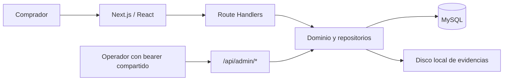

# Auditoría Full Stack de Blue Cat Landing

- **Fecha:** 20 de julio de 2026.
- **Alcance:** `blue-cat-landing` (Next.js, React, TypeScript, API Routes, MySQL y almacenamiento local de comprobantes).
- **Rol de revisión:** Arquitectura de software, Tech Lead, QA y seguridad.
- **Estado recomendado:** **piloto local controlado**; **no habilitar pagos reales ni publicar las APIs administrativas en Internet** hasta cerrar los bloqueantes críticos y altos.

La aplicación principal `Blue-Cat` no forma parte de este informe. Su árbol de trabajo contiene cambios independientes que se preservaron deliberadamente para no mezclarlos con la landing.

# Resumen Ejecutivo

La base técnica es ordenada para el tamaño actual: usa Server Components por defecto, TypeScript estricto, esquemas Zod, consultas MySQL parametrizadas, transacciones en operaciones sensibles, tokens de seguimiento almacenados como hash y cabeceras de seguridad razonables. Las rutas públicas y los tres contratos consumidos por el frontend existen; no se detectaron SQL Injection, consultas N+1, imports sin uso ni fugas de memoria evidentes.

Sin embargo, el sistema todavía no es apto para cobrar dinero en producción pública. El mayor riesgo no está en la presentación de la landing, sino en la frontera entre compra, transferencia, revisión administrativa, persistencia de evidencia y operación del servicio.

| Severidad | Cantidad | Lectura ejecutiva |
|---|---:|---|
| Crítica | 5 | Bloquean pagos reales o exposición pública. |
| Alta | 14 | Pueden causar fraude, estados comerciales falsos, pérdida de evidencia o regresiones graves. |
| Media | 10 | Reducen accesibilidad, mantenibilidad, escalabilidad y operación. |
| Baja | 3 | Deuda técnica y calidad editorial/SEO. |
| **Total** | **32** | Hallazgos consolidados, sin inflar duplicados entre capas. |

Validaciones realizadas:

- `npm run lint`: aprobado.
- `npm run typecheck`: aprobado.
- `npm test`: 4 archivos y 13 pruebas aprobadas.
- `npm run build`: aprobado.
- `npm audit`: 2 vulnerabilidades moderadas transitivas asociadas a PostCSS dentro de Next.js; no existe una corrección automática segura actualmente.
- Rutas públicas principales: 200 en ejecución de producción local.
- Casos negativos API: 401 sin token, 403 por origen inválido, 415 por tipo de contenido y 422 para evidencia inválida.
- Flujo integrado con MySQL aislado: solicitud, idempotencia, seguimiento, reporte, revisión y aprobación probados previamente.
- QA visual: sin desbordamiento horizontal en escritorio ni móvil en las rutas inspeccionadas; el formulario respeta parámetros `plan` y `cloud`.

Arquitectura observada:



La separación `app/components/config/modules/infrastructure` es una buena dirección, pero la máquina de estados comercial está distribuida entre SQL y rutas. El almacenamiento de archivos y MySQL no forman una unidad atómica. Esos dos límites arquitectónicos explican varias inconsistencias encontradas.

# Errores encontrados

Esta sección es el catálogo canónico. Las secciones posteriores agrupan los mismos identificadores por disciplina para evitar repetir explicación y código.

## Hallazgos críticos

### C-01 — Secretos de ejemplo predecibles son aceptados como credenciales reales

- **Severidad:** Crítica.
- **Archivo/línea:** `.env.example:6,18`, `README.md:15,29-34`, `src/lib/admin-auth.ts:6-13`, `src/modules/purchases/domain/commercial-offer.ts:26-29`.
- **Explicación:** el README indica copiar `.env.example`. Los textos `replace-with-at-least-32-random-characters` superan la única validación de longitud, por lo que funcionan como secretos conocidos.
- **Riesgo e impacto:** toma de control de `/api/admin/*`, descarga de comprobantes y falsificación del flujo comercial si una instalación conserva los valores de ejemplo.
- **Solución propuesta:** esquema de entorno centralizado que rechace placeholders y falle al iniciar; generación automática de secretos durante despliegue.
- **Dificultad / tiempo:** 2/5; 2–4 horas.
- **Ejemplo corregido:**

```ts
const forbidden = new Set(["replace-with-at-least-32-random-characters"]);
const secret = z.string().min(32).refine(value => !forbidden.has(value));
export const env = z.object({
  ADMIN_API_TOKEN: secret,
  PURCHASE_TOKEN_SECRET: secret,
}).parse(process.env);
```

- **Justificación técnica:** una advertencia documental no es un control; las configuraciones inseguras deben ser imposibles de arrancar.

### C-02 — Administración con bearer compartido, sin identidad, MFA, RBAC ni doble control

- **Severidad:** Crítica.
- **Archivo/línea:** `src/lib/admin-auth.ts:5-13`, `src/app/api/admin/payment-reports/route.ts:19-56`, `src/app/api/admin/purchase-requests/[trackingId]/quote/route.ts:11-30`, `src/modules/payments/domain/payment-state.ts:6-20`.
- **Explicación:** todas las personas usan `ADMIN_API_TOKEN` y quedan auditadas como el mismo `ADMIN_ACTOR_ID`. El mismo actor puede cotizar, revisar, descargar evidencia y aprobar diferencias.
- **Riesgo e impacto:** fraude interno, ausencia de no repudio, exposición de PII financiera y falta de segregación de funciones.
- **Solución propuesta:** identidad individual, sesión `HttpOnly`, MFA, RBAC y permisos separados para cotizar, revisar y aprobar; doble aprobación para excepciones.
- **Dificultad / tiempo:** 5/5; 5–10 días.
- **Ejemplo corregido:**

```ts
const admin = await requireAdminSession(request);
await requirePermission(admin, "payments:approve");
if (report.reviewedBy === admin.userId) {
  throw new DomainError("SECOND_APPROVER_REQUIRED");
}
```

- **Justificación técnica:** un secreto de servicio identifica una integración, no a una persona; no sirve para autorización granular ni auditoría financiera.

### C-03 — Cuerpo multipart/JSON puede agotar la memoria antes de validar el tamaño

- **Severidad:** Crítica para exposición pública.
- **Archivo/línea:** `src/app/api/payment-reports/route.ts:24-28,43`, `src/app/api/purchase-requests/route.ts:14-20`, `src/modules/payments/domain/evidence-validation.ts:12-25`.
- **Explicación:** si falta `Content-Length`, es inválido o se usa transferencia fragmentada, la validación se evade. `formData()`, `arrayBuffer()` y la inspección PDF crean varias copias completas en RAM.
- **Riesgo e impacto:** denegación de servicio por agotamiento de memoria; una sola ruta puede derribar todo el proceso Next.js.
- **Solución propuesta:** límite real en proxy/runtime, parser multipart por streaming, timeout, cuota y límite de concurrencia. Rechazar encabezados ambiguos como defensa adicional.
- **Dificultad / tiempo:** 4/5; 1–2 días.
- **Ejemplo corregido:**

```nginx
client_max_body_size 6m;
client_body_timeout 15s;
```

```ts
const raw = request.headers.get("content-length");
if (!raw || !/^\d+$/.test(raw)) return apiError(411, "CONTENT_LENGTH_REQUIRED");
if (Number(raw) > MAX_REQUEST_BYTES) return apiError(413, "PAYLOAD_TOO_LARGE");
```

- **Justificación técnica:** el tamaño declarado por el cliente nunca debe ser la única frontera de recursos del servidor.

### C-04 — Evidencias financieras sin cuarentena, antivirus/CDR ni almacenamiento seguro

- **Severidad:** Crítica para producción pública.
- **Archivo/línea:** `src/modules/payments/domain/evidence-validation.ts:6-25`, `src/modules/payments/infrastructure/local-evidence-storage.ts:11-41`, `src/app/api/admin/payment-reports/[id]/evidence/route.ts:21-26`.
- **Explicación:** validar firma y buscar texto peligroso no neutraliza PDF ofuscado, polyglots, contenido comprimido ni bombas de imagen. Los archivos viven en disco local, sin cifrado de aplicación, cuota o replicación.
- **Riesgo e impacto:** malware contra operadores, llenado de disco, pérdida de evidencia, filtración de PII y fallos al escalar a varias réplicas.
- **Solución propuesta:** object storage privado con cifrado KMS, cuarentena, AV/CDR, límites de píxeles, retención y URLs firmadas breves desde un origen aislado.
- **Dificultad / tiempo:** 5/5; 4–8 días.
- **Ejemplo corregido:**

```text
uploaded -> quarantined -> scanned -> sanitized -> reviewable
                              \-> rejected
```

- **Justificación técnica:** un comprobante es entrada no confiable y evidencia financiera; requiere controles de malware, integridad, disponibilidad y retención simultáneamente.

### C-05 — El cobro puede habilitarse mientras contratos y políticas siguen provisionales

- **Severidad:** Crítica de salida comercial.
- **Archivo/línea:** `src/components/legal/legal-page.tsx:2`, `src/components/forms/purchase-request-form.tsx:47`, `src/app/licencia/page.tsx:4`, `src/modules/purchases/domain/commercial-offer.ts:16-23`.
- **Explicación:** la interfaz declara que términos, privacidad y licencia requieren revisión profesional, pero basta configurar oferta e instrucciones bancarias para pasar a `pending_payment`.
- **Riesgo e impacto:** aceptación de dinero sin reglas finales de devolución, tratamiento de datos, impuestos, alcance de licencia y actualizaciones.
- **Solución propuesta:** interruptor de comercio desactivado por defecto y gate técnico que exija versiones legales aprobadas, datos tributarios y canal de reembolso antes de emitir una cotización pagable.
- **Dificultad / tiempo:** 2/5 técnico más revisión legal; 1 día de código.
- **Ejemplo corregido:**

```ts
if (!env.COMMERCE_ENABLED || env.LEGAL_STATUS !== "approved") {
  return { status: "pending_quote", offer: null };
}
```

- **Justificación técnica:** un release gate convierte una condición legal/operativa en una precondición verificable, no en una expectativa manual.

## Hallazgos altos

### A-01 — Cotizaciones vencidas: UI bloquea, backend acepta y no existe renovación

- **Severidad:** Alta.
- **Archivo/línea:** `src/components/purchases/purchase-tracker.tsx:67-72`, `src/modules/purchases/infrastructure/mysql-purchase-access-repository.ts:42-48`, `src/modules/payments/infrastructure/mysql-payment-repository.ts:34-48`.
- **Explicación:** la UI oculta el pago vencido y pide actualizar; el endpoint de pago no valida `offer_expires_at`; el endpoint de cotización solo acepta `pending_quote` y no puede renovar `pending_payment` vencida.
- **Riesgo e impacto:** bypass directo por API y solicitudes atrapadas sin recuperación.
- **Solución propuesta:** entidad `purchase_quotes` versionada, transición explícita `expired -> requoted` y validación de vigencia en backend.
- **Dificultad / tiempo:** 3/5; 1–2 días.
- **Ejemplo corregido:**

```sql
SELECT id, status FROM purchase_requests
WHERE tracking_id = ?
  AND status = 'pending_payment'
  AND offer_expires_at > CURRENT_TIMESTAMP(6)
FOR UPDATE;
```

- **Justificación técnica:** las reglas de negocio deben imponerse en el servidor y conservar el historial de cada oferta.

### A-02 — Un comprobante duplicado puede responder un estado comercial falso

- **Severidad:** Alta.
- **Archivo/línea:** `src/modules/payments/infrastructure/mysql-payment-repository.ts:40-48`, `src/app/api/payment-reports/route.ts:46-51`.
- **Explicación:** el repositorio devuelve cualquier evidencia con el mismo SHA antes de validar su estado; la ruta fabrica siempre `status: "payment_reported"`, incluso si fue rechazada o la compra ya cambió.
- **Riesgo e impacto:** el cliente cree que el pago fue informado cuando la base continúa en otro estado.
- **Solución propuesta:** retornar estado real de compra/reporte y prohibir reutilizar evidencia rechazada.
- **Dificultad / tiempo:** 2/5; 4–6 horas.
- **Ejemplo corregido:**

```ts
if (existing?.reportStatus === "rejected") {
  throw new DomainError("REJECTED_EVIDENCE_REUSED");
}
return { reportId: existing.id, duplicate: true, purchaseStatus: purchase.status };
```

- **Justificación técnica:** una API idempotente debe devolver el resultado persistido, nunca construir un estado supuesto.

### A-03 — Máquina de estados distribuida y metadatos de transición desactualizados

- **Severidad:** Alta.
- **Archivo/línea:** `src/modules/payments/domain/payment-state.ts:6-20`, `src/modules/payments/infrastructure/mysql-payment-repository.ts:48-55,105-118`, `src/modules/purchases/infrastructure/mysql-purchase-access-repository.ts:45-55`, `database/migrations/002_payment_transfer_workflow.sql:15-17`.
- **Explicación:** distintos repositorios actualizan el agregado con SQL propio; pago y revisión no incrementan `version` ni actualizan `status_changed_at`.
- **Riesgo e impacto:** auditoría temporal incorrecta, carreras y regresiones de estado al añadir generación de licencias.
- **Solución propuesta:** servicio de dominio `PurchaseWorkflow` con tabla de transiciones y actualización optimista única.
- **Dificultad / tiempo:** 4/5; 2–4 días.
- **Ejemplo corregido:**

```sql
UPDATE purchase_requests
SET status = ?, status_changed_at = CURRENT_TIMESTAMP(6), version = version + 1
WHERE id = ? AND version = ?;
```

- **Justificación técnica:** el agregado debe tener una sola autoridad para invariantes y concurrencia.

### A-04 — Archivo y base no son atómicos; integridad SHA no se verifica al descargar

- **Severidad:** Alta.
- **Archivo/línea:** `src/app/api/payment-reports/route.ts:43-53`, `src/modules/payments/infrastructure/mysql-payment-repository.ts:30-66,87-92`, `src/app/api/admin/payment-reports/[id]/evidence/route.ts:21-26`.
- **Explicación:** el archivo se escribe antes de la transacción. Un commit incierto puede provocar que la ruta borre un archivo ya referenciado; un crash deja huérfanos. Aunque se guarda SHA-256, no se recalcula al servir.
- **Riesgo e impacto:** pérdida o sustitución silenciosa de evidencia y restauraciones inconsistentes.
- **Solución propuesta:** patrón de cuarentena/estado pendiente, promoción después del commit, reconciliador por hash y verificación al leer.
- **Dificultad / tiempo:** 4/5; 2–4 días.
- **Ejemplo corregido:**

```ts
const actual = createHash("sha256").update(bytes).digest();
if (!timingSafeEqual(actual, Buffer.from(row.evidenceSha256, "hex"))) {
  throw new DomainError("EVIDENCE_INTEGRITY_FAILURE");
}
```

- **Justificación técnica:** las operaciones entre dos recursos requieren estados recuperables y reconciliación; una transacción MySQL no cubre el disco.

### A-05 — Cuenta bancaria y configuración financiera mutables, sin snapshot ni validación central

- **Severidad:** Alta.
- **Archivo/línea:** `src/modules/purchases/domain/commercial-offer.ts:10-23`, `src/app/api/purchase-requests/[trackingId]/route.ts:19-20`, `.env.example:1-19`.
- **Explicación:** las instrucciones bancarias se leen del entorno en cada consulta; cambiar la variable altera retroactivamente cotizaciones abiertas. Otras variables admiten URL inválida, versión demasiado larga o días que generan fechas inválidas.
- **Riesgo e impacto:** pago desviado, oferta no reproducible y errores 500 tardíos.
- **Solución propuesta:** validar todo el entorno al iniciar y guardar `bank_account_version`/destino en cada versión de cotización.
- **Dificultad / tiempo:** 3/5; 1–2 días.
- **Ejemplo corregido:**

```ts
const quote = await quotes.issue({
  amountMinor,
  currency,
  bankAccountVersion: activeBankAccount.version,
  expiresAt,
});
```

- **Justificación técnica:** una cotización debe ser un snapshot inmutable y auditable de lo que se ofreció.

### A-06 — Rate limiting evadible, autenticación administrativa sin límite y tabla sin limpieza

- **Severidad:** Alta.
- **Archivo/línea:** `src/lib/http-security.ts:13-32`, `database/migrations/002_payment_transfer_workflow.sql:45-52`, rutas `src/app/api/admin/**/route.ts`.
- **Explicación:** se confía en `X-Forwarded-For` y `User-Agent`, ambos falsificables; los rechazos de bearer ocurren antes del rate limit; cada ventana deja filas expiradas.
- **Riesgo e impacto:** fuerza bruta, spam, evasión de cuotas y crecimiento indefinido de MySQL.
- **Solución propuesta:** proxy confiable que reescriba IP, límite preautenticación, Redis/Valkey con TTL, WAF/CAPTCHA y limpieza temporal mientras se migra.
- **Dificultad / tiempo:** 3/5; 1–2 días.
- **Ejemplo corregido:**

```sql
DELETE FROM api_rate_limits
WHERE expires_at < CURRENT_TIMESTAMP(6)
LIMIT 10000;
```

- **Justificación técnica:** una identidad controlada por el atacante no puede ser la clave principal de un control antiabuso.

### A-07 — Rotar `PURCHASE_TOKEN_SECRET` rompe idempotencia y recuperación de token

- **Severidad:** Alta.
- **Archivo/línea:** `src/modules/purchases/domain/commercial-offer.ts:26-41`, `src/modules/purchases/infrastructure/mysql-purchase-repository.ts:40-54,86-94`.
- **Explicación:** el mismo secreto deriva el token y el hash del cuerpo. Tras rotarlo, un reintento legítimo genera conflicto y el token regenerado ya no coincide con el hash almacenado.
- **Riesgo e impacto:** solicitudes inaccesibles o no reintentables durante una rotación de claves.
- **Solución propuesta:** hash canónico estable para idempotencia, token aleatorio, claves versionadas y keyring de rotación.
- **Dificultad / tiempo:** 4/5; 1–2 días.
- **Ejemplo corregido:**

```ts
const requestHash = sha256(canonicalJson(payload));
const accessToken = randomBytes(32).toString("base64url");
await saveTokenHash(sha256(accessToken), env.PURCHASE_TOKEN_KEY_VERSION);
```

- **Justificación técnica:** idempotencia y autenticación tienen ciclos de vida distintos y no deben compartir una derivación secreta.

### A-08 — Monto, moneda y fecha comercial no tienen un contrato único

- **Severidad:** Alta.
- **Archivo/línea:** `src/components/forms/payment-report-form.tsx:22,44-46`, `src/components/purchases/purchase-tracker.tsx:68-82`, `src/modules/payments/domain/payment-report.ts:3,8-10`, `.env.example:10-12`.
- **Explicación:** el backend usa unidades menores, el formulario pide un entero ambiguo y toma moneda global; el tracker usa otra variable pública de decimales. `toISOString()` calcula el día en UTC, no en `America/Santiago`.
- **Riesgo e impacto:** montos ×100 en USD/EUR y transferencias registradas como el día siguiente en Chile.
- **Solución propuesta:** DTO `Money`, exponente ISO servido por backend, monto esperado no editable y fecha civil validada en zona de negocio.
- **Dificultad / tiempo:** 3/5; 1–2 días.
- **Ejemplo corregido:**

```ts
type MoneyDto = { amountMinor: string; currency: string; exponent: number };
const display = new Intl.NumberFormat("es-CL", {
  style: "currency", currency: money.currency,
}).format(Number(money.amountMinor) / 10 ** money.exponent);
```

- **Justificación técnica:** dinero nunca debe depender de `float` ni de dos configuraciones independientes; una fecha comercial tampoco equivale a una fecha UTC.

### A-09 — Cliente HTTP sin validación runtime, timeout, cancelación ni errores consistentes

- **Severidad:** Alta.
- **Archivo/línea:** `src/components/forms/purchase-request-form.tsx:22-30`, `src/components/forms/payment-report-form.tsx:25-36`, `src/components/purchases/purchase-tracker.tsx:47-55`.
- **Explicación:** las respuestas se fuerzan con `as`, siempre se intenta `response.json()` y se ignoran `fields`, `requestId`, `Retry-After`, 409/422/429. Un request colgado mantiene el formulario bloqueado.
- **Riesgo e impacto:** ruptura silenciosa de contratos, mensajes técnicos al usuario y acciones tardías después de navegar.
- **Solución propuesta:** cliente tipado compartido con Zod, lectura segura, timeout/abort y mapeo de errores por campo.
- **Dificultad / tiempo:** 3/5; 1–2 días.
- **Ejemplo corregido:**

```ts
const response = await fetch(url, { ...init, signal: AbortSignal.timeout(15_000) });
const json = await readJsonSafely(response);
const result = apiResponseSchema.safeParse(json);
if (!result.success) throw new PublicApiError("Respuesta inesperada", response.status);
```

- **Justificación técnica:** TypeScript no valida datos externos; el borde HTTP necesita comprobación en ejecución.

### A-10 — Configuración pública puede publicar localhost y datos comerciales de ejemplo

- **Severidad:** Alta para publicación.
- **Archivo/línea:** `src/config/site.ts:5-6`, `src/app/layout.tsx:8-12`, `src/app/contacto/page.tsx:7`, `src/app/sitemap.ts:4`, `.env.example:1-2`.
- **Explicación:** el fallback es `http://localhost:3000` y el contacto puede seguir como `ventas@tu-dominio.cl`; metadata, canonical y sitemap quedan inválidos sin fallar el build.
- **Riesgo e impacto:** SEO roto, enlaces sociales locales y pérdida de solicitudes comerciales.
- **Solución propuesta:** validación de producción durante build/start y `alternates.canonical` por página.
- **Dificultad / tiempo:** 1/5; 1–2 horas.
- **Ejemplo corregido:**

```ts
if (process.env.NODE_ENV === "production" && siteUrl.hostname === "localhost") {
  throw new Error("NEXT_PUBLIC_SITE_URL must be public in production");
}
```

- **Justificación técnica:** una configuración pública inválida debe impedir el artefacto, no degradarlo silenciosamente.

### A-11 — Migraciones no versionadas, ligadas a una base fija y ejecutadas con `root`

- **Severidad:** Alta.
- **Archivo/línea:** `database/migrations/001_commercial_foundation.sql:1-2`, `database/migrations/002_payment_transfer_workflow.sql:1`, `.env.example:3`, `README.md:17-18`.
- **Explicación:** los SQL fuerzan `blue_cat_commercial`, no registran checksum/versión y un DDL parcial queda confirmado. El ejemplo usa `root` sin contraseña para runtime.
- **Riesgo e impacto:** migración al esquema equivocado, estado parcial y compromiso total de MySQL desde la app.
- **Solución propuesta:** runner versionado (Dbmate/Flyway o propio), backup previo, pruebas upgrade/rollback y usuarios `migrator`/`app` separados con mínimo privilegio y TLS.
- **Dificultad / tiempo:** 3/5; 1–2 días.
- **Ejemplo corregido:**

```sql
GRANT SELECT, INSERT, UPDATE ON blue_cat_commercial.* TO 'bluecat_app'@'%';
-- DDL queda reservado para bluecat_migrator durante despliegue.
```

- **Justificación técnica:** el usuario de ejecución no necesita DDL ni privilegios globales; migrar requiere trazabilidad y destino explícito.

### A-12 — Consentimientos, PII y comprobantes sin evidencia legal ni ciclo de vida completo

- **Severidad:** Alta.
- **Archivo/línea:** `database/migrations/002_payment_transfer_workflow.sql:12-15,21-43`, `src/modules/payments/domain/payment-report.ts:12`, `src/modules/payments/infrastructure/mysql-payment-repository.ts:50-52`, `docs/security.md:5`.
- **Explicación:** la migración asigna versiones legales provisionales retroactivas; el consentimiento del pago no persiste versión/fecha. No hay retención, anonimización, legal hold ni borrado verificable.
- **Riesgo e impacto:** incapacidad para demostrar qué aceptó la persona y conservación indefinida de datos financieros.
- **Solución propuesta:** documentos versionados con hash, consentimiento explícito por evento y políticas/jobs de retención según propósito y obligación legal.
- **Dificultad / tiempo:** 3/5; 2–4 días más definición legal.
- **Ejemplo corregido:**

```sql
ALTER TABLE payment_reports
  ADD privacy_version VARCHAR(40) NOT NULL,
  ADD privacy_document_hash CHAR(64) NOT NULL,
  ADD consented_at TIMESTAMP(6) NOT NULL;
```

- **Justificación técnica:** la evidencia de consentimiento debe apuntar al texto exacto y al instante real, no a un valor por defecto agregado después.

### A-13 — Quality gate incompleto: no hay CI de la landing ni cobertura integrada/E2E

- **Severidad:** Alta.
- **Archivo/línea:** `package.json:8-14,29-30`, `vitest.config.ts:4-7`, `.github/workflows/baseline.yml`, `.github/workflows/security.yml`, `.github/workflows/release.yml`.
- **Explicación:** existen 13 pruebas de reglas puras, pero no componentes, rutas, MySQL automatizado, concurrencia, migraciones, accesibilidad o E2E. Los workflows raíz no ejecutan lint/tipos/tests/build de `blue-cat-landing`.
- **Riesgo e impacto:** el flujo que cobra dinero puede fusionarse roto aunque los checks generales estén verdes.
- **Solución propuesta:** workflow propio con MySQL, `npm ci`, lint, tipos, cobertura, build, migración limpia/upgrade y Playwright.
- **Dificultad / tiempo:** 3/5; 3–5 días para una base sólida.
- **Ejemplo corregido:**

```yaml
- run: npm ci
  working-directory: blue-cat-landing
- run: npm run lint && npm run typecheck && npm run test:coverage && npm run build
  working-directory: blue-cat-landing
```

- **Justificación técnica:** una suite que solo prueba funciones puras no valida contratos HTTP, persistencia ni experiencia de usuario.

### A-14 — Pool, health checks y observabilidad no sostienen operación real

- **Severidad:** Alta operativa.
- **Archivo/línea:** `src/infrastructure/database/mysql.ts:5-13`, rutas API con `console.error`, ausencia de `src/app/api/health/**`.
- **Explicación:** pool fijo de 8 con cola potencialmente ilimitada, sin timeout/TLS/instrumentación; no existen liveness/readiness, métricas, trazas, alertas ni auditoría de accesos fallidos.
- **Riesgo e impacto:** degradación en cascada cuando MySQL se ralentiza y diagnósticos tardíos durante incidentes.
- **Solución propuesta:** pool configurable y acotado, timeouts, TLS, health endpoints, logging estructurado y OpenTelemetry/Sentry.
- **Dificultad / tiempo:** 3/5; 1–2 días.
- **Ejemplo corregido:**

```ts
mysql.createPool({
  uri: env.DATABASE_URL,
  connectionLimit: env.DB_POOL_SIZE,
  queueLimit: 100,
  connectTimeout: 5_000,
  enableKeepAlive: true,
  ssl: env.DB_SSL,
});
```

- **Justificación técnica:** limitar trabajo en espera evita que una dependencia lenta consuma toda la memoria del proceso.

## Hallazgos medios

### M-01 — Seguimiento sin actualización automática y formulario de pago sin precargar estado

- **Severidad:** Media.
- **Archivo/línea:** `src/components/purchases/purchase-tracker.tsx:40-57`, `src/app/informar-pago/[trackingId]/page.tsx:12`, `src/components/forms/payment-report-form.tsx:16-23`.
- **Explicación:** el tracker consulta una vez y puede conservar la vista anterior al cambiar token; la ruta directa de pago no carga cotización, vencimiento ni estado actual.
- **Riesgo e impacto:** el cliente percibe el proceso bloqueado o ve temporalmente datos obsoletos; intenta reportar sobre una compra ya revisada o vencida.
- **Solución propuesta:** hook `usePurchaseStatus`, limpieza inmediata, botón refrescar y polling pausado cuando la pestaña no es visible; renderizar pago solo para estado vigente.
- **Dificultad / tiempo:** 2/5; 4–8 horas.
- **Ejemplo corregido:**

```ts
useEffect(() => {
  setView(null); setLoading(true); setError("");
  const controller = new AbortController();
  void load(controller.signal);
  const timer = setInterval(() => document.hidden || void load(controller.signal), 15_000);
  return () => { controller.abort(); clearInterval(timer); };
}, [trackingId, token]);
```

- **Justificación técnica:** el estado cambia fuera del navegador; una única lectura no representa un workflow asíncrono.

### M-02 — Formularios no asocian errores ni estados asíncronos con tecnologías asistivas

- **Severidad:** Media.
- **Archivo/línea:** `src/components/forms/purchase-request-form.tsx:35-48,55-56`, `src/components/forms/payment-report-form.tsx:39,43-50,57`, `src/components/purchases/purchase-tracker.tsx:59-61`.
- **Explicación:** faltan `aria-describedby`, `aria-invalid`, foco tras éxito y regiones `aria-live`; enlaces legales dentro del `label` pueden alternar el checkbox y no están subrayados.
- **Riesgo e impacto:** usuarios de lector de pantalla no saben qué campo falló ni cuándo terminó una operación.
- **Solución propuesta:** componente `Field` accesible único, errores con ID/rol, estados anunciados y enlaces legales separados.
- **Dificultad / tiempo:** 2/5; 4–8 horas.
- **Ejemplo corregido:**

```tsx
<input aria-invalid={Boolean(error)} aria-describedby={error ? `${id}-error` : undefined} />
{error && <span id={`${id}-error`} role="alert">{error}</span>}
```

- **Justificación técnica:** la proximidad visual no crea una relación programática; WCAG exige nombre, estado y descripción accesibles.

### M-03 — Jerarquía de títulos y controles de navegación incompletos

- **Severidad:** Media.
- **Archivo/línea:** `src/components/marketing/product-demo.tsx:4-11`, `src/components/layout/site-header.tsx:22-29`, `src/components/tutorials/tutorial-player.tsx:13-24`.
- **Explicación:** el demo introduce un `h3` antes del primer `h2`; el menú móvil no cierra con Escape ni gestiona foco; el tutorial captura flechas globalmente y su progreso carece de semántica.
- **Riesgo e impacto:** navegación confusa con teclado/lector y atajos que interfieren con otros controles.
- **Solución propuesta:** demo como imagen descriptiva o jerarquía correcta, menú con foco/Escape/`aria-current`, teclado acotado y `role="progressbar"`.
- **Dificultad / tiempo:** 2/5; 4–6 horas.
- **Ejemplo corregido:**

```tsx
<div role="progressbar" aria-valuemin={1} aria-valuemax={steps.length}
  aria-valuenow={step + 1} aria-label="Progreso del tutorial" />
```

- **Justificación técnica:** la semántica debe reflejar la estructura real y los atajos globales deben respetar el foco activo.

### M-04 — Cuerpos malformados pueden responder 500 y los errores públicos no son uniformes

- **Severidad:** Media.
- **Archivo/línea:** `src/app/api/purchase-requests/route.ts:20-32`, `src/app/api/payment-reports/route.ts:28-67`, `src/app/api/admin/purchase-requests/[trackingId]/quote/route.ts:18-30`, `src/app/api/admin/payment-reports/route.ts:44-55`.
- **Explicación:** errores de `request.json()`/`formData()` llegan al catch general; el MIME se reconoce por coincidencia parcial y no todas las respuestas incluyen la misma forma de problema.
- **Riesgo e impacto:** 500 engañosos, alertas ruidosas y frontend incapaz de distinguir entrada inválida de falla del servidor.
- **Solución propuesta:** wrapper `apiHandler`, parser seguro, MIME exacto y contrato Problem Details con `code`, `message`, `fields`, `requestId` y `Retry-After`.
- **Dificultad / tiempo:** 2/5; 1 día.
- **Ejemplo corregido:**

```ts
try { body = await request.json(); }
catch { return apiError(400, "MALFORMED_BODY", requestId); }
```

- **Justificación técnica:** los códigos HTTP forman parte del contrato y determinan reintento, soporte y observabilidad.

### M-05 — Validación de origen depende de `Host` y CSP conserva `unsafe-inline`

- **Severidad:** Media.
- **Archivo/línea:** `src/lib/http-security.ts:5-11`, `next.config.ts:11`.
- **Explicación:** `origin === requestOrigin` puede confiar en un `Host` manipulado detrás de un proxy mal configurado. La CSP permite scripts y estilos inline, debilitando mitigación XSS.
- **Riesgo e impacto:** bypass de same-origin en despliegues incorrectos y menor defensa ante una futura inyección.
- **Solución propuesta:** allowlist exacta obligatoria en producción, hosts permitidos en proxy y CSP con nonce/hash sin `unsafe-inline` para scripts.
- **Dificultad / tiempo:** 3/5; 1–2 días.
- **Ejemplo corregido:**

```ts
const allowedOrigins = new Set(env.ALLOWED_ORIGINS);
if (!origin || !allowedOrigins.has(new URL(origin).origin)) {
  return apiError(403, "ORIGIN_NOT_ALLOWED");
}
```

- **Justificación técnica:** el origen aceptado debe provenir de configuración confiable, no de otra cabecera del mismo request.

### M-06 — Integridad y escalabilidad de datos insuficientes

- **Severidad:** Media.
- **Archivo/línea:** `database/migrations/001_commercial_foundation.sql:4-42`, `database/migrations/002_payment_transfer_workflow.sql:3-43`, `src/modules/purchases/infrastructure/mysql-purchase-repository.ts:56-59`, `src/modules/payments/infrastructure/mysql-payment-repository.ts:69-84`.
- **Explicación:** faltan constraints para combinaciones estado/monto/revisor, índices globales de auditoría, y la cola administrativa usa `LIMIT 100` sin cursor. Cada solicitud crea otro `customer` aun con el mismo RUT/correo.
- **Riesgo e impacto:** estados imposibles, historial fragmentado, purgas lentas y reportes recientes ocultos.
- **Solución propuesta:** CHECK/constraints o tablas de estado, decisión explícita entre cliente reutilizable y snapshot, índices de auditoría y paginación por cursor.
- **Dificultad / tiempo:** 3/5; 2–3 días.
- **Ejemplo corregido:**

```sql
ALTER TABLE audit_events
  ADD INDEX idx_audit_request (request_id),
  ADD INDEX idx_audit_created (created_at);
```

- **Justificación técnica:** invariantes críticas deben sobrevivir a cualquier escritor y las listas operativas no pueden depender de un corte fijo.

### M-07 — Despliegue y restauración no son reproducibles

- **Severidad:** Media.
- **Archivo/línea:** `docs/deployment.md:7-18`; ausentes `Dockerfile`, `docker-compose.yml`, `.dockerignore` y procedimiento automatizado de restore.
- **Explicación:** el servidor depende de pasos manuales; MySQL y evidencias no tienen snapshot coordinado ni prueba periódica de restauración.
- **Riesgo e impacto:** diferencias entre entornos y recuperación incompleta tras incidente.
- **Solución propuesta:** imagen multi-stage sin privilegios, salida standalone, Compose de desarrollo/piloto y backup consistente con prueba de restore.
- **Dificultad / tiempo:** 3/5; 1–3 días.
- **Ejemplo corregido:**

```dockerfile
FROM node:22-alpine AS runner
USER node
COPY --from=builder /app/.next/standalone ./
CMD ["node", "server.js"]
```

- **Justificación técnica:** reproducibilidad y restauración comprobada son requisitos operativos, no documentación opcional.

### M-08 — Peso de assets/dependencias sin presupuesto de rendimiento

- **Severidad:** Media.
- **Archivo/línea:** `public/og.png` (1,336,156 bytes), `public/brand/blue-cat-logo.png` (304,261 bytes), `package.json:21,28,37`, `postcss.config.mjs:3`.
- **Explicación:** assets grandes; Tailwind parece aportar principalmente `animate-spin`; Framer Motion añade un chunk aislado al tutorial. `npm audit` reporta dos avisos moderados de PostCSS transitivo.
- **Riesgo e impacto:** más transferencia en móviles, superficie de dependencias y regresiones no detectadas.
- **Solución propuesta:** optimizar OG/logo, presupuesto Brotli por ruta en CI y decidir si se adopta Tailwind o se sustituye la utilidad restante por CSS local. Actualizar Next cuando exista parche compatible; no ejecutar `audit fix --force`.
- **Dificultad / tiempo:** 2/5; 4–8 horas.
- **Ejemplo corregido:**

```css
@keyframes spin { to { transform: rotate(360deg); } }
.spinner { animation: spin .8s linear infinite; }
```

- **Justificación técnica:** dependencias y bytes deben justificar una capacidad real y medirse automáticamente.

### M-09 — Manejo de carga y errores de ruta incompleto

- **Severidad:** Media.
- **Archivo/línea:** `src/app/error.tsx:1-2`; ausentes `src/app/global-error.tsx` y `src/app/**/loading.tsx`.
- **Explicación:** no existe fallback para el layout raíz ni skeletons de rutas; el error actual no registra `digest`. El tracker puede mostrar brevemente “Falta el acceso seguro” antes de hidratar el fragmento.
- **Riesgo e impacto:** UX brusca y soporte sin correlación suficiente ante fallos reales.
- **Solución propuesta:** `global-error.tsx`, loading por grupo, estado neutral de hidratación y telemetría del digest sin exponer detalles.
- **Dificultad / tiempo:** 2/5; 4–6 horas.
- **Ejemplo corregido:**

```tsx
export default function GlobalError({ error }: { error: Error & { digest?: string } }) {
  reportClientError(error.digest);
  return <html><body><main role="alert">No pudimos cargar Blue Cat.</main></body></html>;
}
```

- **Justificación técnica:** las fronteras de error deben existir al mismo nivel que la ruta que puede fallar.

### M-10 — Las APIs administrativas existen, pero no hay consola operativa segura

- **Severidad:** Media de producto/operación.
- **Archivo/línea:** `src/app/api/admin/**`, `docs/payment-transfer-workflow.md:38-63`; no existe `src/app/admin/**`.
- **Explicación:** cotizar, revisar, ver evidencia y aprobar depende de llamadas manuales con PowerShell/cURL y un bearer compartido.
- **Riesgo e impacto:** errores humanos, secretos copiados en terminales/historial y operación no escalable.
- **Solución propuesta:** después de C-02, construir consola administrativa con colas, comparación de monto, doble aprobación, historial y descarga aislada.
- **Dificultad / tiempo:** 4/5; 1–2 semanas.
- **Ejemplo corregido:**

```ts
export const adminRoutes = {
  paymentQueue: "/admin/payments",
  purchaseQuote: (id: string) => `/admin/purchases/${id}/quote`,
} as const;
```

- **Justificación técnica:** una API financiera sin interfaz controlada traslada validaciones y seguridad al operador.

## Hallazgos bajos

### B-01 — Duplicación pequeña y ruta huérfana

- **Severidad:** Baja.
- **Archivo/línea:** `src/components/forms/payment-report-form.tsx:12-14,57`, `src/components/forms/purchase-request-form.tsx:55-56`, `src/components/purchases/purchase-tracker.tsx:20-22`, `src/app/comprar/confirmacion/page.tsx`, `src/components/forms/purchase-confirmation.tsx`.
- **Explicación:** se repiten hook de fragmento, `Field` y regex de tracking; la confirmación ya no recibe enlaces desde el flujo actual.
- **Riesgo e impacto:** correcciones divergentes y superficie que confunde mantenimiento.
- **Solución propuesta:** extraer `useFragmentPurchaseToken`, `AccessibleField`, `trackingIdSchema`; eliminar o redirigir confirmación.
- **Dificultad / tiempo:** 1/5; 2–4 horas.
- **Ejemplo corregido:**

```ts
export const trackingIdSchema = z.string().uuid();
export function useFragmentPurchaseToken() { /* una implementación */ }
```

- **Justificación técnica:** una única definición elimina diferencias entre página, API y formulario.

### B-02 — Metadata social y sitemap imprecisos

- **Severidad:** Baja.
- **Archivo/línea:** `src/app/layout.tsx:8-12`, `src/app/sitemap.ts:4`, `public/og.png`.
- **Explicación:** metadata declara 1792×1024 pero la imagen mide 1731×909; todas las rutas usan `new Date()` como modificación y páginas internas heredan OG genérico.
- **Riesgo e impacto:** recortes sociales y señales SEO de actualización falsas.
- **Solución propuesta:** OG 1200×630 optimizada, dimensiones reales, metadata por página y fechas de contenido estables.
- **Dificultad / tiempo:** 1/5; 2–3 horas.
- **Ejemplo corregido:**

```ts
{ url: `${siteConfig.url}/licencias`, lastModified: new Date("2026-07-20") }
```

- **Justificación técnica:** metadata debe describir el artefacto real y no cambiar sin un cambio de contenido.

### B-03 — Legibilidad y documentación arquitectónica desalineadas

- **Severidad:** Baja.
- **Archivo/línea:** varias páginas compactadas en una línea (`src/app/actualizaciones/page.tsx:4`, `src/app/licencias/page.tsx:7`, `src/app/modulos/page.tsx:7`), `docs/decisions/0004-public-purchase-workflow.md`.
- **Explicación:** markup completo en una línea dificulta blame/review; ADR 0004 permanece “proposed” aunque el flujo ya está implementado y documentos sugieren que admin no está publicado pese a existir rutas.
- **Riesgo e impacto:** deuda de lectura y decisiones operativas ambiguas.
- **Solución propuesta:** formatear, aceptar/reemplazar ADR y declarar explícitamente exposición y controles de `/api/admin/*`.
- **Dificultad / tiempo:** 1/5; 2–4 horas.
- **Ejemplo corregido:**

```md
Status: Accepted
Decision: `/api/admin/*` remains network-restricted until OIDC/MFA/RBAC is active.
```

- **Justificación técnica:** ADR y código deben describir la misma realidad para que una decisión de despliegue sea reproducible.

# Problemas Frontend

Los principales problemas frontend son A-08, A-09, A-10, M-01, M-02, M-03, M-08, M-09, B-01 y B-02.

| Área solicitada | Evaluación |
|---|---|
| Organización | Buena separación entre rutas, componentes, configuración y módulos; algunas páginas demasiado compactas. |
| Reutilización | Adecuada para el tamaño, con duplicación puntual de `Field`, token de fragmento y regex. |
| Estado | Estado local suficiente; Redux/Zustand/Context no aportarían valor hoy. Falta un hook de workflow/polling. |
| Rutas | App Router y code splitting por ruta correctos; confirmación está huérfana. |
| Formularios | React Hook Form + Zod es una fortaleza; errores HTTP, abort, dinero, fecha y accesibilidad son incompletos. |
| Loading/errores | Hay estados de envío y `error.tsx`; faltan timeout, `loading.tsx`, `global-error.tsx` y foco/`aria-live`. |
| UX/responsive | No hubo overflow en 390 px ni escritorio; el proceso asíncrono no se refresca y el CTA promete transferencia cuando puede quedar en cotización. |
| Accesibilidad | Skip link, focus visible y reduced motion presentes; faltan relaciones de error, foco, headings y navegación móvil completa. |
| Renders/memoria | No se observaron loops o leaks. `AbortController` y limpieza de listeners están bien aplicados. |
| Lazy loading | App Router separa correctamente formularios y tutorial; Framer Motion no llega a la home. |
| Tipado | `strict` y sin `any`/`ts-ignore`; el punto débil son casts de respuestas HTTP sin validación runtime. |

# Problemas Backend

Los bloqueantes backend son C-01 a C-04 y A-01 a A-07, A-11, A-12 y A-14. La arquitectura de dominio es una buena base, pero las rutas todavía orquestan demasiadas responsabilidades: seguridad HTTP, parseo, reglas de workflow, archivos, persistencia y respuestas.

Fortalezas confirmadas:

- Consultas parametrizadas; no se detectó SQL Injection.
- El SQL dinámico del listado proviene de una allowlist.
- No se detectaron N+1; los listados usan joins.
- Transacciones y `FOR UPDATE` presentes en operaciones sensibles.
- Token de seguimiento de alta entropía; solo su hash queda persistido.
- Errores públicos sanitizados y `requestId` disponible.

Arquitectura objetivo recomendada:

```text
route handler
  -> middleware HTTP común (origen, límite, auth, requestId)
  -> application service (caso de uso)
  -> PurchaseWorkflow (invariantes/transiciones)
  -> repositories / evidence gateway
  -> outbox + audit events
```

# Problemas de integración

| Integración | Estado | Hallazgo |
|---|---|---|
| `POST /api/purchase-requests` | Coincide método/DTO/idempotencia | Manejo de error y tamaño incompletos (C-03, A-09). |
| `GET /api/purchase-requests/{trackingId}` | Coincide header `Purchase-Token` y DTO principal | No hay polling; instrucciones bancarias son mutables (A-05, M-01). |
| `POST /api/payment-reports` | Coinciden nombres multipart | Backend permite vencidos; dinero/fecha ambiguos; duplicado miente (A-01, A-02, A-08). |
| Cotización vencida | **Incompatible** | UI pide renovación, backend no la soporta (A-01). |
| Estado de pago | **Incompatible** | UI bloquea vencido, una llamada directa puede aceptarlo (A-01). |
| Errores HTTP | Parcial | Front ignora `fields`, `requestId`, `Retry-After`; cuerpo malformado puede ser 500 (A-09, M-04). |
| Auth comprador | Opaque token en fragmento | Diseño prudente, pero sin recuperación/revocación y con rotación acoplada (A-07). |
| Auth administrador | **No apta para Internet** | Bearer global sin identidad ni MFA (C-02). |
| CORS/CSRF | Same-origin, sin CORS amplio | Correcto como base; endurecer origen/Host (M-05). |
| JWT/refresh token | No aplican actualmente | No existe JWT. Al crear consola admin se recomienda sesión/OIDC y rotación, no añadir JWT por inercia. |

# Problemas de Base de Datos

Hallazgos asociados: A-03, A-04, A-06, A-07, A-11, A-12, A-14 y M-06.

- Migraciones sin registro de versión, destino fijo y sin prueba automatizada de upgrade/rollback.
- Usuario de ejemplo con privilegios excesivos.
- Estados financieros no protegidos completamente por constraints.
- `version` y `status_changed_at` no se mantienen en todas las transiciones.
- Rate limits sin expiración física.
- Cola administrativa sin cursor.
- Falta índice global por `request_id` y `created_at` en auditoría.
- Decisión de identidad de cliente no definida: se crean duplicados por cada solicitud.
- Persistencia y evidencia no pueden restaurarse coherentemente sin un procedimiento conjunto.

No se detectaron consultas N+1 ni interpolación de datos no confiables en SQL. Los índices de tracking, token, idempotencia y cola son una fortaleza inicial.

# Problemas de Seguridad

Prioridad de cierre:

1. C-01 secretos conocidos.
2. C-02 identidad administrativa/MFA/RBAC.
3. C-03 límites reales de request.
4. C-04 cuarentena/AV/CDR/cifrado.
5. C-05 gate legal y comercial.
6. A-06 antiabuso confiable.
7. A-07 rotación separada.
8. A-12 consentimiento/retención.
9. M-05 origen y CSP.

No se encontró XSS explotable en el código revisado: React escapa contenido y el JSON-LD reemplaza `<`. Tampoco se encontró SQL Injection ni CORS permisivo. Estas ausencias no compensan los bloqueantes de autenticación administrativa y archivos no confiables.

# Problemas de Rendimiento

- **Memoria:** C-03 es el riesgo principal; multipart/PDF se materializa varias veces.
- **Backpressure:** A-14; pool y cola sin límites operativos suficientes.
- **Base de datos:** A-06 y M-06; tablas crecientes y listado sin cursor.
- **Frontend:** M-08; assets grandes y sin presupuesto de bundle. El code splitting por ruta funciona correctamente.
- **Caché:** no conviene cachear seguimiento privado; sí pueden cachearse assets estáticos y páginas públicas con una política explícita.
- **Renders:** no se observaron renders patológicos; el proyecto no necesita memoización indiscriminada.
- **Escala:** disco local impide réplicas horizontales; C-04/A-04 deben resolverse antes de escalar.

# Código a refactorizar

| Objetivo | Archivos actuales | Destino recomendado |
|---|---|---|
| Máquina de estados | repositorios de purchases/payments | `src/modules/purchases/domain/purchase-workflow.ts` |
| Casos de uso | rutas API + repositorios | `application/report-payment.ts`, `review-payment.ts`, `issue-quote.ts` |
| Borde HTTP | todas las rutas | `src/server/http/api-handler.ts`, `api-error.ts` |
| Entorno | accesos dispersos a `process.env` | `src/config/env.server.ts` validado una vez |
| Dinero | frontend/backend/config separados | contrato compartido `MoneyDto` y tabla ISO |
| Tracking/token | regex y hash duplicados | módulo `tracking-id.ts` + hook `useFragmentPurchaseToken` |
| Campos | dos implementaciones `Field` | componente accesible único |
| Evidencia | ruta + disco + DB | gateway de cuarentena y reconciliador |

Se recomienda mantener la arquitectura simple: servicios de aplicación y módulos de dominio, sin introducir Redux, microservicios ni event sourcing completo antes de necesitarlos. Un outbox pequeño para operaciones financieras sí está justificado.

# Código duplicado

- Lectura/suscripción del token de fragmento en `payment-report-form.tsx` y `purchase-tracker.tsx`.
- Componente `Field` en ambos formularios.
- Regex de tracking en páginas, dominio y rutas administrativas.
- Autenticación, rate limit, request ID, `no-store` y formato de error en handlers.
- Transiciones de `purchase_requests` mediante SQL repartido.
- Etiquetas de disponibilidad de módulos en home y `/modulos` con semántica distinta.

La duplicación es todavía contenida; conviene eliminarla durante la corrección funcional, no mediante una reescritura masiva.

# Código muerto

- `src/app/comprar/confirmacion/page.tsx` y `src/components/forms/purchase-confirmation.tsx`: ningún flujo actual enlaza a esta pantalla.
- `StoredEvidence.absolutePath`: se retorna pero el consumidor actual no lo utiliza.
- `originalName` en validación de evidencia: se recibe y se descarta con `void`.
- Estado `purchase_requests.rejected`: el rechazo de comprobante regresa a `pending_payment`; debe definirse su uso o retirarse del workflow.
- Testing Library/jsdom instalados pero sin tests: no son necesariamente descartables, pero hoy son deuda sin uso.

No se detectaron imports muertos mediante ESLint.

# Mejoras recomendadas

La tabla transforma los 32 hallazgos en entregables verificables. Los tiempos son estimaciones de ingeniería y no incluyen revisión legal externa.

| Prioridad | Problema / riesgo | Impacto | Solución | Dificultad | Tiempo | Archivos principales |
|---|---|---|---|---:|---:|---|
| 🔴 Crítica | Secretos de ejemplo utilizables (C-01) | Control administrativo comprometido | Env schema, denylist y generación de secretos | 2/5 | 2–4 h | `.env.example`, `src/config/env.server.ts`, auth/oferta |
| 🔴 Crítica | Bearer admin global (C-02) | Fraude y cero trazabilidad individual | OIDC/sesión, MFA, RBAC, doble aprobación | 5/5 | 5–10 d | `src/lib/admin-auth.ts`, `src/app/api/admin/**` |
| 🔴 Crítica | Upload sin límite efectivo (C-03) | Caída por RAM | Proxy + streaming + timeout/cuotas | 4/5 | 1–2 d | payment/purchase routes, proxy |
| 🔴 Crítica | Comprobantes inseguros (C-04) | Malware, pérdida y PII | Object storage, cuarentena, AV/CDR, KMS | 5/5 | 4–8 d | evidence validation/storage/download |
| 🔴 Crítica | Pago con legales provisionales (C-05) | Riesgo contractual/comercial | Gate `COMMERCE_ENABLED` y versiones aprobadas | 2/5 | 1 d | legal pages, offer config, purchase service |
| 🟠 Alta | Vencimiento/renovación inconsistente (A-01) | Bypass y compras bloqueadas | Cotizaciones versionadas + workflow | 3/5 | 1–2 d | purchase/payment repositories, migration |
| 🟠 Alta | Estado duplicado falso (A-02) | Cliente recibe información incorrecta | Resultado persistido y reglas de reuso | 2/5 | 4–6 h | payment repository/route |
| 🟠 Alta | Transiciones dispersas (A-03) | Carreras y auditoría incorrecta | `PurchaseWorkflow`, versión optimista | 4/5 | 2–4 d | domain + repositories + tests |
| 🟠 Alta | Disco/DB no atómicos (A-04) | Evidencia perdida o corrupta | Estado pendiente, outbox/reconciliador, hash | 4/5 | 2–4 d | storage, payment service, jobs |
| 🟠 Alta | Destino bancario mutable (A-05) | Pago desviado/no reproducible | Versionar cuenta y snapshot por oferta | 3/5 | 1–2 d | env, quote model/repository |
| 🟠 Alta | Antiabuso evadible (A-06) | Spam/fuerza bruta/tabla infinita | Trusted proxy, Redis TTL, pre-auth limit | 3/5 | 1–2 d | `http-security.ts`, migrations, proxy |
| 🟠 Alta | Rotación rompe idempotencia (A-07) | Reintentos inaccesibles | Hash estable, token aleatorio, keyring | 4/5 | 1–2 d | offer + purchase repository |
| 🟠 Alta | Dinero/fecha divergentes (A-08) | Montos y fechas incorrectos | `MoneyDto`, minor unit y timezone única | 3/5 | 1–2 d | forms, tracker, payment domain |
| 🟠 Alta | Cliente HTTP frágil (A-09) | UX y contratos rotos | SDK interno con Zod/timeout/errors | 3/5 | 1–2 d | forms, tracker, `src/lib/api-client.ts` |
| 🟠 Alta | Config pública de ejemplo (A-10) | SEO/canal comercial inválido | Fallar build/start con placeholders | 1/5 | 1–2 h | site config, layout, sitemap |
| 🟠 Alta | Migraciones/root (A-11) | Daño total o esquema erróneo | Runner, backups, mínimos privilegios, TLS | 3/5 | 1–2 d | migrations, README, env |
| 🟠 Alta | Consentimiento/retención (A-12) | Incumplimiento y PII indefinida | Hash/versiones, jobs, legal hold | 3/5 | 2–4 d | migrations, schemas, privacy docs |
| 🟠 Alta | Sin quality gate (A-13) | Releases rotos | CI MySQL + coverage + E2E + migraciones | 3/5 | 3–5 d | workflows, tests, package scripts |
| 🟠 Alta | Operación ciega (A-14) | Incidentes en cascada | Pool acotado, health, logs, métricas | 3/5 | 1–2 d | mysql, API, health routes |
| 🟡 Media | Tracker/UX asíncrona (M-01) | Flujo aparentemente estancado | Hook, polling y refresh | 2/5 | 4–8 h | tracker, payment page/form |
| 🟡 Media | Accesibilidad (M-02/M-03) | Usuarios excluidos | ARIA, foco, headings, teclado, axe | 2/5 | 1–2 d | forms, header, demo, tutorial |
| 🟡 Media | Errores API (M-04/M-05) | 500 falsos y defensa débil | Handler común, allowlist y CSP nonce | 3/5 | 1–2 d | API routes, security, Next config |
| 🟡 Media | Integridad/escala DB (M-06) | Estados imposibles/listas truncadas | Constraints, cursor, índices, modelo cliente | 3/5 | 2–3 d | migrations, repositories |
| 🟡 Media | Despliegue/performance (M-07/M-08) | Entornos divergentes y carga móvil | Contenedor, restore, assets y budgets | 3/5 | 2–4 d | Docker/CI/assets/package |
| 🟢 Baja | Duplicados, metadata y docs (B-01/B-03) | Mantenimiento/SEO | Refactor focalizado y ADR actualizado | 1/5 | 1 d | components, sitemap, docs |

# Nuevas funcionalidades sugeridas

Estas funcionalidades deben construirse después de cerrar los riesgos de integridad y seguridad, no en paralelo con pagos inseguros.

1. **Portal administrativo seguro:** cola de cotizaciones/pagos, comparación automática, doble aprobación, auditoría y exportación.
2. **Servicio de licencias:** entitlement firmado, dispositivos/sedes permitidos, activación online/offline, desactivación y recuperación.
3. **Portal del cliente:** historial, reenvío seguro del enlace, descarga de licencia/factura y estado de soporte.
4. **Versionado de cotizaciones:** reemisión, superseded/expired, historial de precio y cuenta bancaria.
5. **Notificaciones transaccionales:** correo al solicitar, cotizar, reportar, aprobar y emitir licencia; idempotentes mediante outbox.
6. **Cloud Sync como add-on:** tenant/sucursal, estado de sincronización, cuota, facturación mensual y observabilidad separada.
7. **Gestión de reembolsos/excepciones:** razón tipificada, permisos especiales y doble control.
8. **Centro de soporte/tutoriales:** búsqueda, progreso opcional, tickets asociados a licencia y telemetría con consentimiento.
9. **Analítica comercial respetuosa de privacidad:** conversión por plan, abandono por etapa y SLA de revisión sin registrar tokens/PII.
10. **Feature flags y kill switches:** deshabilitar comercio, uploads o administración sin desplegar código.

# Plan de refactorización por fases

## Fase R0 — Contención inmediata (1–2 días)

- Rechazar secretos/placeholders, localhost y usuario DB inseguro.
- Mantener `COMMERCE_ENABLED=false` y bloquear `/api/admin/*` fuera de la red operativa.
- Aplicar límite de request en proxy y timeout.
- Corregir estado de duplicado y rechazo de cotización vencida.
- **Salida:** la landing puede demostrarse sin aceptar una operación insegura.

## Fase R1 — Integridad comercial y de datos (1 semana)

- Implementar `PurchaseWorkflow` y cotizaciones versionadas.
- Corregir `version/status_changed_at`, dinero, moneda y zona horaria.
- Separar idempotencia/token y añadir rotación.
- Adoptar runner de migraciones, constraints e índices.
- Persistir consentimiento exacto.
- **Salida:** cada transición y monto son reproducibles y auditables.

## Fase R2 — Seguridad administrativa y de evidencia (1–2 semanas)

- Identidad individual, MFA, RBAC y segregación de funciones.
- Consola administrativa mínima.
- Object storage privado, cuarentena, AV/CDR, cifrado e integridad.
- Redis/WAF/rate limit confiable.
- **Salida:** operadores y archivos dejan trazabilidad individual y segura.

## Fase R3 — QA, observabilidad y resiliencia (1 semana)

- CI completo, tests HTTP/MySQL/componentes/E2E/concurrencia.
- Health checks, logging, métricas, alertas y SLO.
- Backups coordinados y simulacro de restore.
- Contenedor reproducible y ambientes separados.
- **Salida:** un cambio roto o una dependencia caída se detectan antes de afectar cobros.

## Fase R4 — Experiencia comercial Beta (1 semana)

- Tracker reactivo, cliente HTTP común y accesibilidad WCAG AA.
- Portal administrativo/cliente, notificaciones y reemisión de cotización.
- Documentos legales finales, impuestos, reembolsos y licencia aprobados.
- Optimización de imágenes y budgets de performance.
- **Salida:** Beta pública limitada, medible y reversible.

## Fase R5 — Escala y producto (posterior a Beta)

- Servicio de licencias, activación y actualizaciones por 12 meses.
- Cloud Sync como suscripción independiente.
- Multi-sucursal, facturación, soporte y analítica.
- Pruebas de carga, DR y revisión de amenazas periódica.

# Checklist de tareas pendientes

## Bloqueo de salida pública

- [ ] Reemplazar y rotar todos los secretos conocidos.
- [ ] Añadir esquema de entorno y rechazo de placeholders.
- [ ] Mantener pagos deshabilitados hasta aprobar documentos legales.
- [ ] Restringir físicamente `/api/admin/*` mientras use bearer compartido.
- [ ] Implementar MFA, RBAC, identidad individual y doble aprobación.
- [ ] Aplicar límite real de body antes del parseo.
- [ ] Incorporar cuarentena, AV/CDR, cifrado y cuotas de evidencia.

## Workflow comercial

- [ ] Modelar cotizaciones versionadas y renovación de vencidas.
- [ ] Validar expiración en backend.
- [ ] Corregir respuesta de evidencia duplicada/rechazada.
- [ ] Centralizar transiciones en `PurchaseWorkflow`.
- [ ] Actualizar `version` y `status_changed_at` siempre.
- [ ] Versionar instrucciones bancarias.
- [ ] Separar hash de idempotencia y token de acceso.
- [ ] Unificar dinero, moneda, exponente y zona horaria.
- [ ] Definir reembolso, cancelación y excepciones.

## Datos y privacidad

- [ ] Adoptar migraciones versionadas con checksum.
- [ ] Probar instalación limpia, upgrade, fallo parcial y rollback/forward-fix.
- [ ] Crear usuarios DB separados y TLS.
- [ ] Añadir constraints e índices de auditoría.
- [ ] Definir cliente reutilizable versus snapshot de compra.
- [ ] Guardar versión/hash/fecha real de cada consentimiento.
- [ ] Definir retención, anonimización, legal hold y borrado auditado.
- [ ] Coordinar backup/restore de MySQL y evidencia.

## Frontend y accesibilidad

- [ ] Crear cliente HTTP validado con timeout/abort.
- [ ] Mapear `fields`, `requestId`, `Retry-After` y códigos HTTP.
- [ ] Implementar hook de estado con refresh/polling.
- [ ] Precargar y bloquear monto/moneda de la cotización.
- [ ] Asociar errores mediante `aria-describedby`/`aria-invalid`.
- [ ] Gestionar foco y regiones vivas tras éxito/error.
- [ ] Corregir menú móvil, headings y progreso del tutorial.
- [ ] Añadir `loading.tsx` y `global-error.tsx`.
- [ ] Eliminar la ruta huérfana y duplicaciones puntuales.

## QA y DevOps

- [ ] Crear workflow de landing con `npm ci`, lint, tipos, test, coverage y build.
- [ ] Añadir MySQL de integración y prueba de migraciones.
- [ ] Añadir Testing Library, axe y Playwright.
- [ ] Cubrir vencimiento, reemisión, concurrencia, rotación, duplicados y commit incierto.
- [ ] Fijar Node/npm (`engines`, `packageManager`, `.nvmrc` o equivalente).
- [ ] Crear imagen/Compose reproducibles sin privilegios.
- [ ] Añadir liveness/readiness y límites del pool.
- [ ] Implementar logs estructurados, métricas, trazas y alertas.
- [ ] Ejecutar simulacro de restauración.
- [ ] Registrar y vigilar los avisos moderados de PostCSS/Next.

## SEO, rendimiento y documentación

- [ ] Validar URL/correo públicos durante build.
- [ ] Corregir OG y metadata por ruta.
- [ ] Usar fechas reales en sitemap.
- [ ] Optimizar logo/OG y añadir presupuesto de bundle.
- [ ] Decidir adopción real o retiro de Tailwind.
- [ ] Actualizar ADR 0004 y documentación de exposición admin.
- [ ] Registrar formalmente el cierre de cada bloqueante con evidencia de prueba.

## Criterio de aceptación de Beta pública

La Beta pública puede autorizarse únicamente cuando:

1. Todos los hallazgos críticos estén cerrados y verificados.
2. A-01 a A-13 estén cerrados o exista una aceptación de riesgo escrita, temporal y con compensaciones.
3. CI, integración MySQL y E2E estén verdes en el commit de release.
4. Exista restore probado, monitoreo activo y rollback documentado.
5. Legal apruebe términos, privacidad, licencia, impuestos y reembolsos.
6. Seguridad valide identidad administrativa y pipeline de archivos.

Hasta entonces, la clasificación correcta del sistema es **piloto local controlado**, aunque lint, tipos, pruebas unitarias y build estén verdes.
