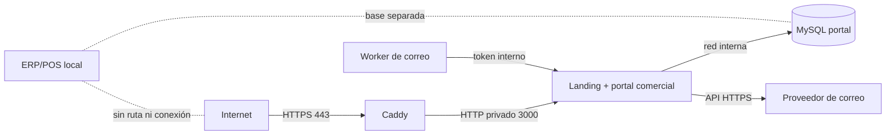

# Despliegue de staging

## Alcance y frontera pública

Staging publica exclusivamente la landing y el portal comercial de `blue-cat-landing/`. El ERP/POS de `Blue-Cat/`, su base operativa, sus endpoints PHP y sus instaladores no forman parte de la imagen ni del `compose.yml`.



La imagen Docker usa `blue-cat-landing/` como contexto. Esto evita que un error de configuración copie el ERP local al artefacto público.

## Requisitos externos

- Servidor Linux de staging con Docker Engine y Docker Compose v2.
- Dominio o subdominio con registro DNS apuntando al servidor.
- Puertos 80 y 443 públicos; 3000 y 3306 cerrados en firewall.
- Acceso de solo lectura al paquete privado de GHCR, si el repositorio no publica imágenes abiertas.
- Dominio remitente verificado y credencial de Resend exclusiva de staging.
- GitHub Environment `staging` y variable `STAGING_COMMERCIAL_EMAIL`.
- `age` y una clave pública de backup custodiada fuera del servidor.
- Copias cifradas fuera del servidor y una restauración ensayada.

## 1. Publicar imágenes inmutables

En GitHub Actions ejecuta `Publish staging images` desde `master`:

- `site_url`: origen HTTPS, por ejemplo `https://staging.dominio.cl`.
- `image_tag`: etiqueta operativa como `staging-2026-08-08`.

El workflow publica dos imágenes con SBOM y procedencia:

- `ghcr.io/lifilab/blue-cat-portal:<commit>`
- `ghcr.io/lifilab/blue-cat-portal:<commit>-migrator`

Para desplegar se usa siempre el SHA completo del commit, no la etiqueta mutable.

## 2. Preparar el servidor

Copiar únicamente estos archivos a un directorio operativo, por ejemplo `/opt/blue-cat-staging`:

- `deploy/staging/compose.yml`
- `deploy/staging/Caddyfile`
- `deploy/staging/.env.staging.example` como `.env.staging`

La cuenta del servicio debe ser no privilegiada. `.env.staging` debe tener permisos `0600` y no debe entrar en Git, tickets, capturas ni respaldos sin cifrar.

Generar valores independientes con un CSPRNG:

```bash
openssl rand -base64 32   # IDENTITY_DATA_KEY
openssl rand -hex 32      # cada pepper/token/password restante
```

`DATABASE_URL` debe apuntar al host interno `database`, nunca a la base del ERP/POS. Use una contraseña alfanumérica aleatoria o codifíquela correctamente para URI. En staging, `DATABASE_CREATE_ALLOWED=false`: el contenedor MySQL crea el esquema inicial y el migrador no recibe privilegios globales para crear otras bases.

## 3. Preflight obligatorio

Desde una copia del proyecto, cargando las variables reales sin imprimirlas:

```bash
cd blue-cat-landing
npm ci
set -a; . /opt/blue-cat-staging/.env.staging; set +a
npm run staging:verify-config
```

El preflight bloquea el despliegue si detecta HTTP, localhost, secretos débiles o repetidos, credenciales bootstrap persistentes, indexación pública o comercio real habilitado.

Validar además la composición:

```bash
cd /opt/blue-cat-staging
docker compose --env-file .env.staging -f compose.yml config --quiet
```

## 4. Backup, migración y arranque

En el primer despliegue no existe backup anterior. En cada actualización posterior:

```bash
mkdir -p backups
docker compose --env-file .env.staging -f compose.yml exec -T database \
  sh -c 'mysqldump --single-transaction -u"$MYSQL_USER" -p"$MYSQL_PASSWORD" "$MYSQL_DATABASE"' \
  | gzip | age -r "$BACKUP_AGE_RECIPIENT" \
  > "backups/portal-$(date -u +%Y%m%dT%H%M%SZ).sql.gz.age"
```

Después:

```bash
docker compose --env-file .env.staging -f compose.yml pull
docker compose --env-file .env.staging -f compose.yml up -d database
docker compose --env-file .env.staging -f compose.yml run --rm migrate
docker compose --env-file .env.staging -f compose.yml up -d portal outbox-worker proxy
docker compose --env-file .env.staging -f compose.yml ps
```

Las migraciones son idempotentes y verifican SHA-256. Una migración ya aplicada nunca se modifica: se agrega otra.

## 5. Verificación posterior

Ejecutar desde una red externa al servidor:

```powershell
$env:STAGING_URL = "https://staging.dominio.cl"
npm run staging:smoke
Remove-Item Env:STAGING_URL
```

El smoke test verifica landing, TLS/headers, liveness, readiness con base, `robots.txt`, aislamiento de rutas internas, comercio deshabilitado y ausencia de rutas conocidas del ERP/POS.

Luego ejecutar [staging-e2e-checklist.md](staging-e2e-checklist.md) y adjuntar evidencias al release candidato.

## 6. Operador de prueba

El bootstrap se ejecuta una sola vez desde un entorno administrativo con acceso a la red de datos. Las variables `OPERATOR_*` se eliminan inmediatamente y el operador activa MFA antes de usar rutas administrativas. No se envían contraseñas por correo.

Para staging puede construirse temporalmente el target `migrator` con el código aprobado y ejecutar `npm run identity:bootstrap-operator`; nunca se habilita acceso remoto a MySQL para facilitar este paso.

## 7. Observación y alertas mínimas

- Monitor externo: `GET /api/health/live` cada minuto.
- Monitor de dependencia: `GET /api/health/ready`; alerta tras tres fallos.
- Alerta de contenedor reiniciando, disco mayor a 80 %, backup fallido y outbox en estado `dead`.
- Logs JSON de Caddy y aplicación con retención definida y sin cuerpos, tokens, cookies ni datos bancarios.
- Revisar certificados y expiración DNS antes de cada demostración.

## 8. Rollback

1. Detener ingreso de tráfico si hay riesgo de corrupción o seguridad.
2. Guardar logs y métricas del incidente.
3. Cambiar `PORTAL_IMAGE_TAG` al SHA anterior y ejecutar `docker compose up -d`.
4. No revertir la base automáticamente si la migración fue aditiva y compatible.
5. Si la migración exige restauración, detener portal/worker, validar el backup en una base temporal y restaurar con doble aprobación.
6. Repetir smoke y los casos críticos E2E antes de reabrir tráfico.

## Criterio de promoción

Staging está listo solo cuando el workflow `Staging readiness` está verde, el preflight real pasa, health permanece estable, backup/restauración tienen evidencia y todos los casos críticos del checklist E2E están aprobados. Esto no habilita pagos reales ni convierte staging en producción.
